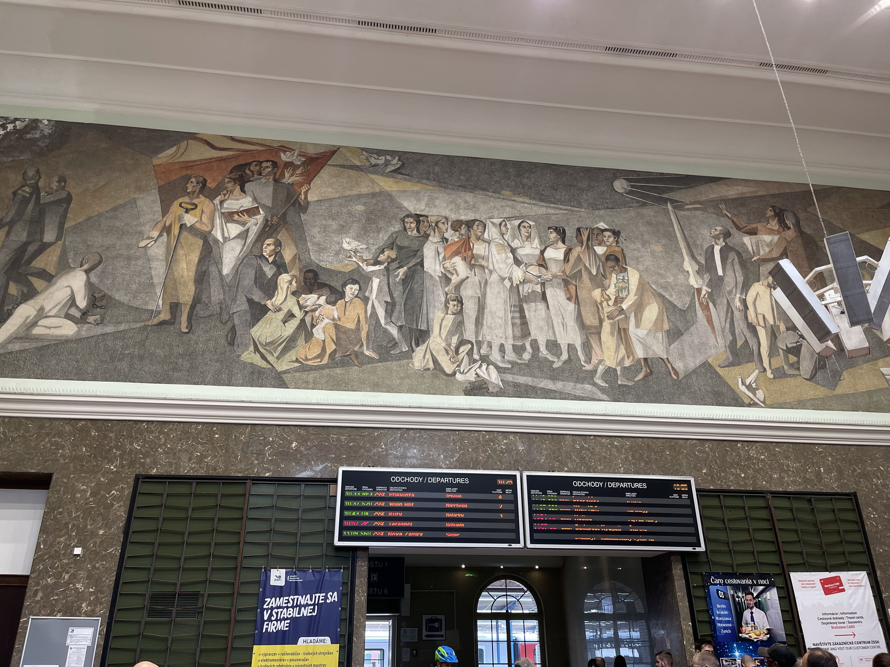
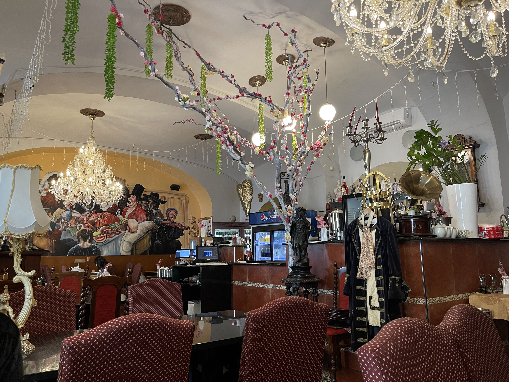
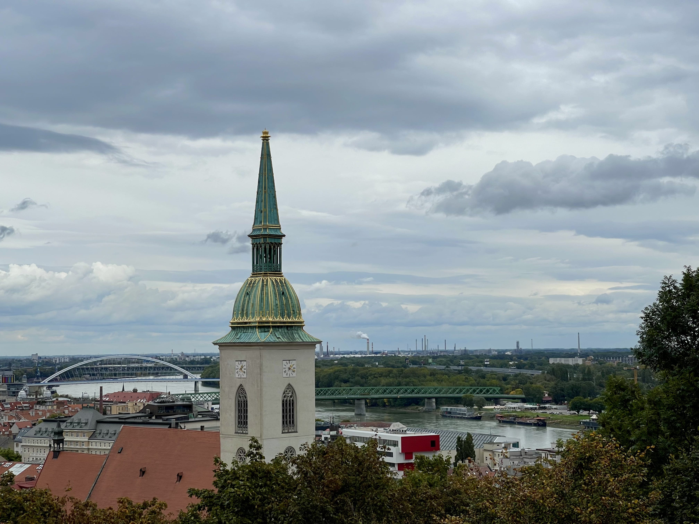

Das erste Sache, was mich erstaunt hat in Bratislava, war das Wandbild im Hauptbahnhof. Kein Wunder, denn dort stieg ich aus dem Zug und setzte meinen Fuß dorthin. So, Ich habe nicht tief darüber nachgedacht als ich es sah. Es war nur ein altes, schönes Gemälde an einer Wand. Aber später, als ich es recherchierte, erfuhr ich mehr. Dieser [Blog](http://socialist-realist.blogspot.com/2011/02/train-station-mural-in-bratislava.html) erklärt es im Detail als sozialistische Kunst.

Dann bin ich in die Altstadt gelaufen. Auf dem Weg dorthin, habe ich den Präsidentenpalast gesehen. Das Gebäude und der Garten waren wunderschön. Noch ein bisschen gelaufen, sah den Martinsdom von weitem. Natürlich habe ich ein paar Fotos gemacht und vorbeigeschaut, um mir das Innere anzusehen. Es gab Gottesdienst. Ich setzte meine Reise fort.

Es war bereits Mittagszeit. Ich bin die ganze Zeit mit meiner Cousine. Wir haben ein nettes Restaurant in der Altstadt gesehen. Wieder, gab es ein Wandbild. Aber ich glaube nicht, dass dieser so alt ist wie der vorherige im Hauptbahnhof. Trotzdem, es war schön. Ich erinnere mich nicht an den Namen der bestellten Suppe. Es war mit Hähnchen und Gemüse. Das hat mir gefallen. An den Wänden hingen interessante Gemälde, die die Stadt und ihre Geschihte darstellten.

Man kann überall in der Stadt sehen von das Schloss Bratislava. Am bemerkenswertesten ist die Martinsdom. Man sieht auch die grünen Wälder im Norden und Westen der Stadt und wie die Donau durch sie hindurchfließt.