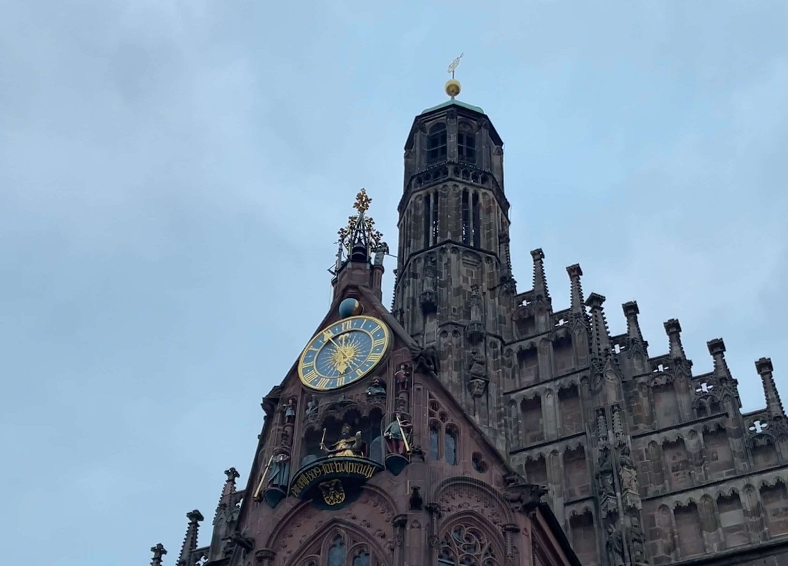
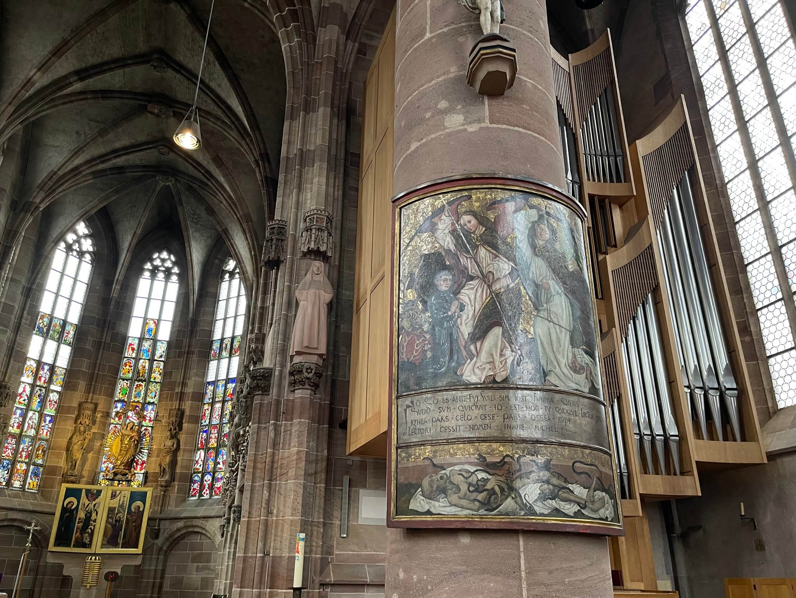

I've officially completed my first ever church service at Nürnberg's Frauenkirche on March 5th, just because I entered the church at the wrong time. I do usually get in to the building, look around, sometimes sit down to stare at the paintings and sculptures of Jesus, the tall windows and the stained glasses. But this time, when I got in, the service was due to start. More people came in and started sitting down, and so did I instinctively. It was about that moment when the Pastor and a sister (I couldn't figure out what her title is) came in.

#### The organ and the beam of light

I do not recall any movie soundtracks that used the organ in such a graceful way other than Interstellar. Ever since I heard Hans Zimmer's (with the organist Roger Sayer) music in Interstellar featuring the organ as the foundation, I fell in love with it. Quoting what Christopher Nolan, the movie's director, has said about using the organ for the film's score:

"The organ, the architectural cathedrals, and all that, they represent mankind's attempt to portray the mystical or the metaphysical, what's beyond us, what's beyond the realm of everyday."

Point is, I have a soft spot for the instrument. Back to the church service. The pastor read some verses from the Bible (I assume). At this point, I decided I should keep sitting, go along with the rituals rather than leaving. I thought that would've been disrespectful for the whole group. But, when the organist layed his fingers on the keyboard and the pipes started chiming, I realized "ok, this is going to be something". The voice of the Pastor started rhyming verses in Latin, with the sounds of the organ resonating in the background, across the high walls of the church. And all along, I can't help but hear Interstellar OST at the back of my head. It was beautiful. You might ask, "What can make that even more beautiful?" A beam of light. Right where I was sitting, the sun was shining through the large window, its beams were descending on me. Yeah, I know that's not a message from God. But it was significant to experience that bit of the service in such a remarkable way.

I followed the rest of the rituals, ate that piece of holy bread that was dipped into holy water. And there I was gone. Of course, I had to come back later that day to take pictures when it was available.

