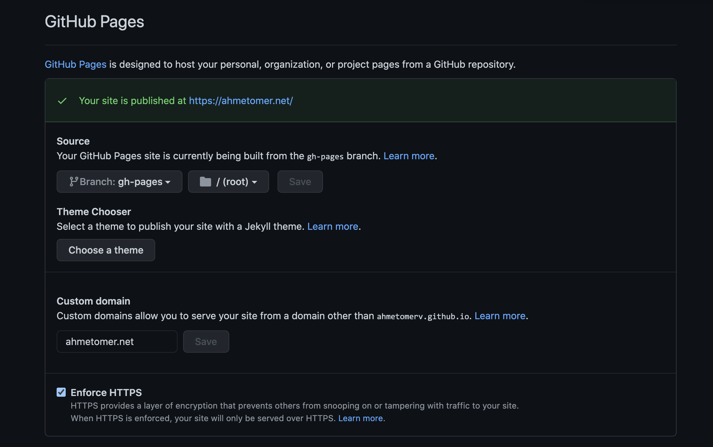
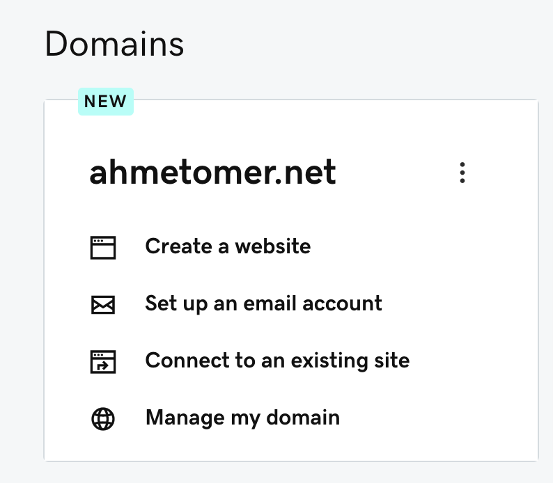
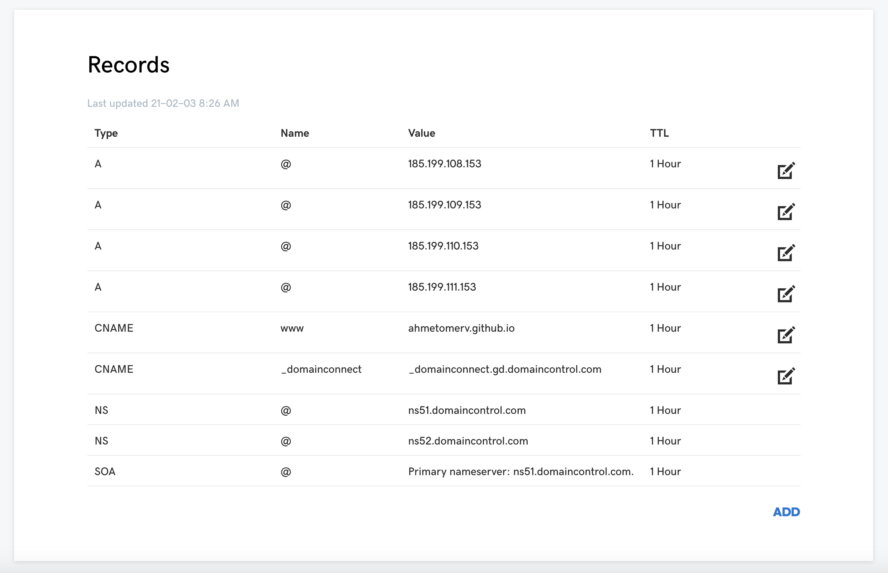

Now, there are many posts and informations about the topic but for my case, I had to stick pieces together from many places to get this simple site up. For starters, I'm assuming you've already purchased a domain name and have a GitHub account. If not, it's fairly easy to set up an account and buy a domain.

_Note:_ This post isn't Gatsby-specific except for few details and is applicable to basically any static site to be hosted with custom domains on GitHub Pages. And for this case I'm using GoDaddy, but the main points hold the same for other providers as well.

---

### 1 - Setting up Gatsby

To set up a Gatsby project, you first need to install it's CLI tool by running:

```markdown
$ npm install -g gatsby-cli
```

You can either initialize a new project by running `npm init gatsby` or clone a ready to use blog starter, which I did, by running:

```markdown
$ git clone https://github.com/gatsbyjs/gatsby.git
```

Once things are finished downloading, you can run `npm run develop` to serve the site locally and see how everything looks like.

### 2 - Deploy to GitHub Pages

First of all, you need to install the `gh-pages` package by running the following:

```markdown
$ npm install gh-pages -g
```

Then, create a repo on your GitHub account with the name `<username>.github.io`. This naming is important to host the site at the root of your domain. Once you've created the repo, you'll find the instructions to push the source of your local project to GitHub.

Next thing to do is build the site and make it ready for the deployment, run `npm run deploy`.

_NOTE:_ If you didn't clone the starter project, you may not have the `deploy` script in your `package.json` file. You can use the deploy script by adding the following line to the scripts object:

```markdown
"deploy": "gatsby build && gh-pages -d public -b gh-pages"
```

Or, you can just run it directly:

```markdown
$ gatsby build && gh-pages -d public -b gh-pages
```

The commands above basically build the Gatsby site (which is also a React app) with all of its contents, and then using the `gh-pages` package, it deploys the `public` folder, which includes the static files, to the associated GitHub repo. The parameter after `-b` is the name of the branch used to push the static files to. You can name it however you like.

### 3 - Connect custom domain



Go to your repo's settings page and scroll down to GitHub Pages section. In the source branch option, you should see the branch name of which you pushed the static files to earlier. If not, you can select that branch.

_NOTE:_ When you publish to GitHub pages using `gh-pages` or change the source branch, it might take a few minutes to go live. Be patient.

If everything went okay, you should see the message "Your site is published at xxx.github.io" (ignore the custom domain in the screenshot, we'll get to it later).

#### Change domain
Staying in the same page, enter your domain name in the Custom domain field and click Save. This will add a CNAME file to your GitHub pages branch in the root directory. This file just contains the name of your custom domain.

Although not very practical, you can add a CNAME file to your main source branch. This file needs to be inside the `static` folder.

#### Change DNS records



In your DNS provider, go to your domain settings. On GoDaddy, go to your products page and click Manage my domain link. In the following page, go to Additional Settings section and click Manage DNS.



This is where the action happens. Add the following records:

| Type | Host                                    | Points To |
| :----- | :--------------------------------------- | ---: |
| CNAME      | www | `<username>.github.io` |
| A      | @ | `185.199.108.153` |
| A      | @ | `185.199.109.153` |
| A      | @ | `185.199.110.153` |
| A      | @ | `185.199.111.153` |

The records above will connect your domain name to the website hosted at GitHub Pages. As of Februray 2021, GitHub pages IPs are as such. If it doesn't seem to work, visit GitHub Pages docs to find the latest IP addresses.

If you don't have an SSL certificate, you can use GitHub's certificates. You can find the option to enable HTTPS in the repo settings.

This is all needed to do. Things may take a while for everything to go live.
