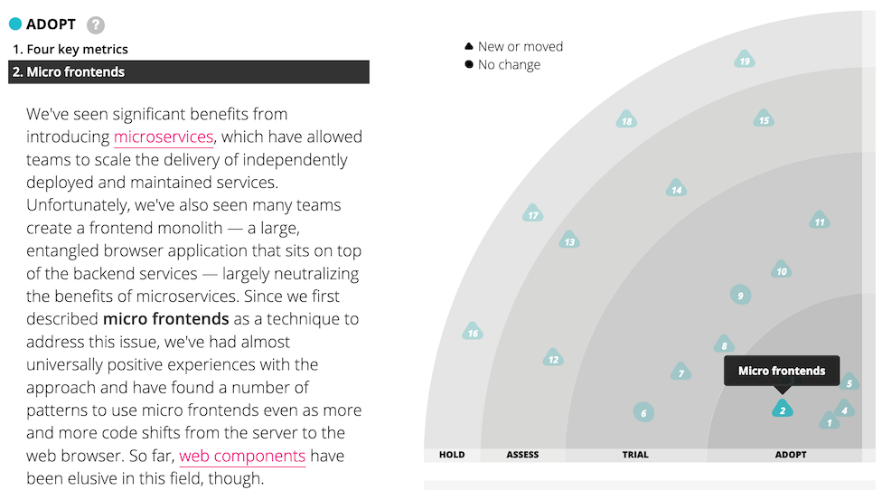
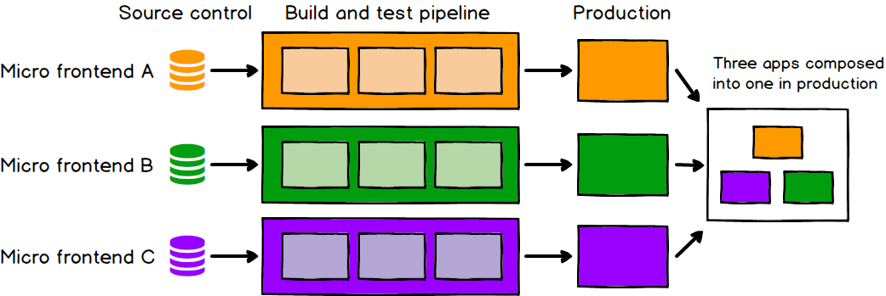
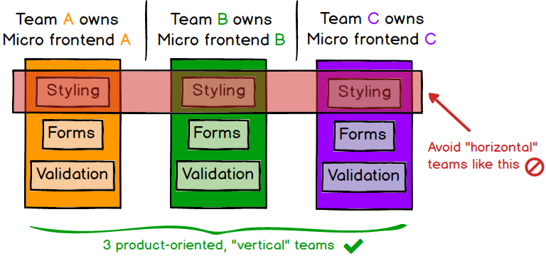
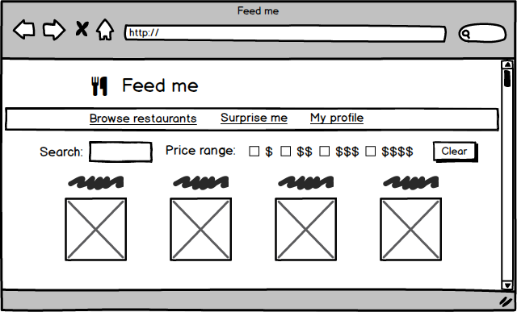
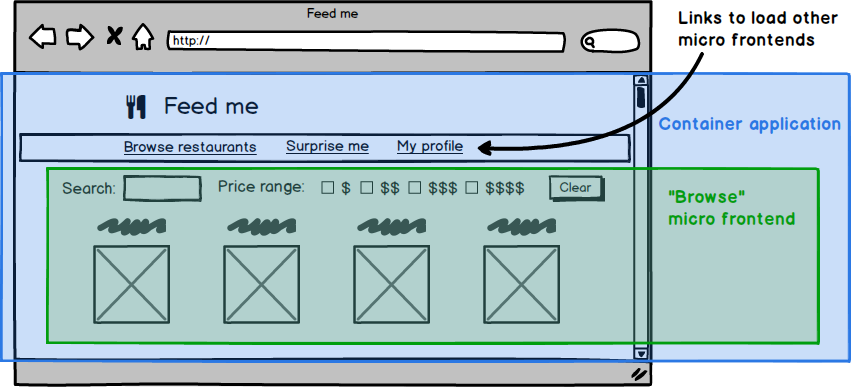
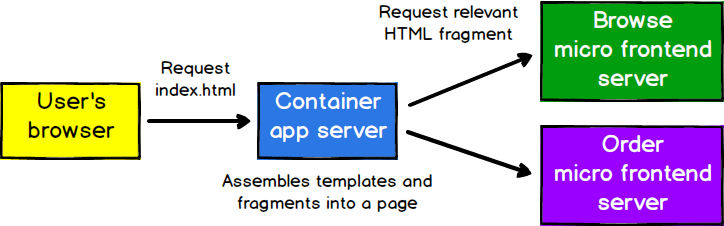
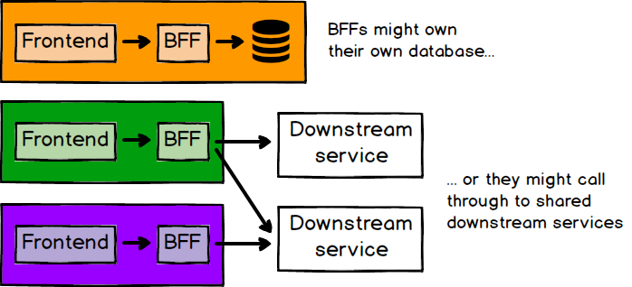
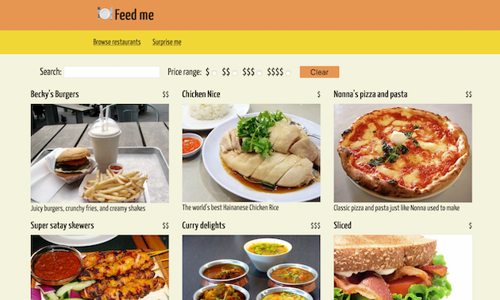
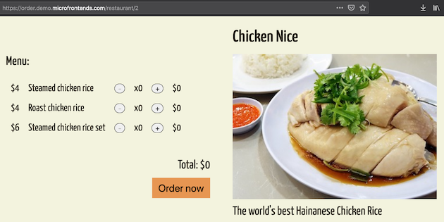
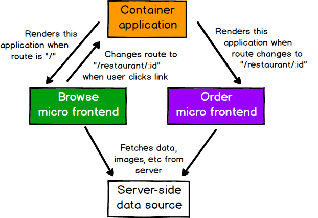

<em>[Cam Jackson](https://camjackson.net/)'ın [Micro Frontends](https://martinfowler.com/articles/micro-frontends.html) adlı makalesinin Türkçe çevirisidir.</em>

İyi bir frontend geliştirmesi yapmak zordur. Frontend geliştirmesini birçok ekibin büyük ve karmaşık bir ürün üzerinde aynı anda çalışabilmesi için ölçeklendirmek daha da zordur. Bu yazıda, frontend monolitlerini daha küçük, daha yönetilebilir parçalara ayırmaya yönelik son günlerdeki yeni bir trendi ve bu mimarinin frontend kodu üzerinde çalışan ekiplerin etkinlik ve verimliliğini nasıl artırdığını açıklayacağız. Bununla beraber çeşitli faydalar ve maliyetler hakkında konuşacağımız gibi, mevcut implementasyon seçeneklerini ele alacağız, ve bu tekniği gösteren tam bir uygulama örneğinin derinliklerine dalacağız.

Son yıllarda [mikroservislerin](https://martinfowler.com/articles/microservices.html) popülaritesi patladı ve birçok organizasyon büyük ve monolitik backend projelerinin sınırlamalarından kaçınmak için bu mimari stili kullanıyor. Server-side yazılımı yapmanın bu stili hakkında çok şey yazılmış olsa da, birçok şirket monolitik frontend kod tabanlarıyla boğuşmaya devam ediyor.

Belki de progressive veya responsive bir web uygulaması yapmak istiyorsunuz, ancak bu özellikleri mevcut koda entegre etmeye başlamak için kolay bir yer bulamıyorsunuz. Belki de yeni JavaScript dil özelliklerini kullanmaya başlamak istiyorsunuz (ya da JavaScript’e derlenen sayısızca dillerden biri), ancak mevcut yapım sürecinize (build process) gerekli yapım araçlarını (build tools) oturtamıyorsunuz. Ya da sadece birden fazla ekibin aynı anda tek bir ürün üzerinde çalışabilmesi için geliştirmenizi ölçeklendirmek istiyorsunuz ancak mevcut monolitteki bağlaşım (coupling) ve karmaşıklık, herkesin birbirinin ayağına bastığı anlamına geliyor. Bunların tümü, müşterilerinize yüksek kaliteli deneyimleri verimli bir şekilde sunma kabiliyetinizi olumsuz yönde etkileyebilecek gerçek sorunlardır.

Son zamanlarda ise, karmaşık ve modern web geliştirme için gerekli olan genel mimariye ve organizasyonel yapılara giderek daha fazla ilgi gösterildiğini görüyoruz. Özellikle de frontend monolitlerini bağımsız olarak geliştirilebilen, test edilebilen ve canlıya çıkılabilen daha küçük ve daha basit parçalara bölmeye yönelik paternlerin ortaya çıktığını görüyoruz. Ve aynı zamanda da müşterilere tek bir birleşik ürün olarak görünmeye devam ederek. Bu tekniğe **mikro frontend** adını veriyoruz ve şöyle tanımlıyoruz:

> "Bağımsız olarak teslim edilebilen frontend uygulamalarının daha büyük bir bütün halinde oluşturulduğu bir mimari stil"

Thoughtworks teknoloji radarının Kasım 2016 sayısında [mikro frontend'leri](https://www.thoughtworks.com/radar/techniques/micro-frontends) organizasyonların Asses (değerlendirmek) etmesi gereken bir teknik olarak listeledik. Daha sonra da Trial (deneme) ve son olarak da Adopt (benimseme) seviyesine yükselttik, bu da yeri geldiğinde kullanmanız gereken kanıtlanmış bir yaklaşım olarak gördüğümüz anlamına geliyor.


<p class="primary-caption">Şekil 1: Mikro frontend'ler, teknoloji radarında birkaç kez göründü</p>

Mikro frontend'lerin gördüğümüz bazı önemli avantajları şunlardır:

- daha küçük, daha uyumlu ve sürdürülebilir kod tabanları
- ayrılmış, otonom ekiplerle daha ölçeklenebilir organizasyonlar
- frontend parçalarını daha önce mümkün olandan daha kademeli bir şekilde yükseltme, güncelleme ve hatta yeniden yazma kabiliyeti

Bu başlıklardaki avantajlarının mikroservislerin sağlayabileceklerinden bazıları olması tesadüf değildir.

Tabii ki, konu yazılım mimarisi olduğunda yok öyle 3 kuruşa 5 köfte — her şeyin bir bedeli var. Bazı mikro frontend implementasyonları bağımlılıkların çoğaltılmasına neden olabilir ve bu, kullanıcılarımızın indirmesi gereken byte sayısını artırır. Ek olarak, ekip otonomluğundaki çarpıcı artış, ekiplerinizin çalışma biçiminde parçalanmaya neden olabilir. Yine de bu risklerin yönetilebileceğine ve genel olarak da mikro frontend'lerin faydalarının, getireceği maliyetlerden fazla olacağına inanıyoruz.

### Faydalar
Mikro frontend'leri belirli teknik yaklaşımlar veya implementasyon detayları olarak tanımlamak yerine ortaya çıkan niteliklere ve bunların sağladığı faydalara vurgu yaparız.

#### Kademeli yükseltmeler
Birçok organizasyon için mikro frontend yolculuklarının başlangıcı budur. Eski ve büyük frontend monoliti geçen yılın yazılım yığını (tech stack) ya da teslimat baskısı altında yazılan kod tarafından geride tutuluyor ve tamamen baştan yazmanın cazip olduğu noktaya geliyor. Bir baştan yazmanın [risklerinden (perils)](https://www.joelonsoftware.com/2000/04/06/things-you-should-never-do-part-i/) kaçınmak için, eski uygulamayı parça parça ele almayı (strangle) tercih ederdik ve bu arada da monolit tarafından yavaşlatılmadan müşterilerimize yeni özellikler sunmaya devam ederiz.

Bu yaklaşım genellikle bir mikro frontend mimarisine yol açar. Bir ekip, eski dünyadaki monolite çok az değişiklik yapıp canlı ortama kadar bir özelliği çıkarma deneyimine sahip olduğunda, diğer ekipler de bu yeni dünyaya katılmak isteyecektir. Mevcut kodun hala sürdürülmesi gerekiyor ve bazı durumlarda da yeni özellikler eklemeye devam etmek mantıklı olabilir, ancak şimdi bunu yapabilme seçeneği var.

Buradaki en önemli nokta ürünümüzün ayrı ayrı parçaları üzerinde duruma göre kararlar verme ve mimarimizde, bağımlılıklarımızda ve kullanıcı deneyimimizde kademeli yükseltmeler yapma konusunda daha fazla özgürlük elde etmemizdir. Eğer ana framework'te büyük ve kırıcı bir değişiklik olursa bütün dünyayı durdurup her şeyi tek seferde yükseltmek zorunda kalmak yerine her bir mikro frontend sadece uygun görüldüğü zaman yükseltilebilir. Yeni bir teknolojiyi veya yeni etkileşim biçimlerini denemek istiyorsak bunu eksisine göre daha izole bir şekilde yapabiliriz.

#### Basit, ayrılmış kod tabanları
Her bir mikro frontend'in kaynak kodu tanım olarak tek bir monolitik frontend'in kaynak kodundan çok daha küçük olacak. Daha küçük olan bu kod tabanları geliştiriciler için çalışılması daha basit ve daha kolay olma eğilimindedir. Özellikle de, birbirinden habersiz olması gereken bileşenler arasındaki kasıtsız ve gereksiz bağlantılardan kaynaklanan karmaşıklıktan kaçınıyoruz. Uygulamanın [sınırlı bağlamları](https://martinfowler.com/bliki/BoundedContext.html) etrafında daha kalın çizgiler çizerek bu tür rastlantısal bağlantıların oluşmasını zorlaştırıyoruz.

Tabii ki, tek bir üst düzey mimari karar (örneğin, "mikro frontend yapalım"), klasik temiz kod yaklaşımının yerini alamaz. Kendimizi kodumuz hakkında düşünmekten ve kalitesine efor sarf etmekten muaf tutmuyoruz. Bunun yerine, kötü kararları zor, iyi kararları ise kolay hale getirerek kendimizi [başarı çukuruna](https://blog.codinghorror.com/falling-into-the-pit-of-success/) düşmeye hazırlamaya çalışıyoruz. Örneğin, domain modellerini sınırlı bağlamlar arasında paylaşmak çok daha zorlaşır, bu nedenle geliştiricilerin bunu yapma olasılığı daha azdır. Benzer şekilde, mikro frontend'ler, verilerin ve event'lerin uygulamanın farklı bölümleri arasında nasıl aktığı konusunda sizi açık ve bilinçli olmaya zorlar, zaten her türlü yapmamız gereken bir şeydi bu!

#### Bağımsız dağıtım
Mikroservislerde olduğu gibi, bağımsız dağıtılabilirlik mikro frontend'lerde de kilit nokta. Bu, herhangi bir dağıtımın kapsamını küçültür ve bu da ilgili riskleri azaltır. Frontend kodunuzun nasıl veya nerede host edildiği farketmeksizin, her bir mikro frontend, onu build ve test eden ve canlı ortama kadar dağıtan CD (Continuous Delivery) hattına sahip olmalıdır. Her bir mikro frontend'i diğer kod tabanlarının veya pipeline'larının mevcut durumu hakkında çok düşünmeden dağıtabilmeliyiz. Eski monolitin sabit, manuel ve üç ayda bir canlıya çıkma döngüsünde olup olmaması veya yandaki ekibin kendi master branch'ine yarım yamalak ya da bozuk bir özelliği göndermiş olup olmaması önemli olmamalıdır. Belirli bir mikro frontend canlıya çıkmaya hazırsa bunu yapabilmeli ve bu karar onu yapan ve sürdüren ekibe bırakılmalıdır.


<p class="primary-caption">Şekil 2: Her bir frontend canlıya bağımsız bir şekilde çıkıyor</p>

#### Otonom Ekipler
Hem kod tabanlarımızı hem de yayın döngülerimizi birbirinden ayırmanın üst düzey bir faydası olarak, fikir aşamasından canlıya çıkışa ve ötesine kadar bir ürünün bir bölümüne sahip olabilen tamamen bağımsız ekiplere sahip olma yolunda uzun bir yol alıyoruz. Bu ekipler, müşterilerine değer sunabilmek için ihtiyaçları olan her şeye tamamen sahip olabilirler, ve bu da hızlı ve etkili bir şekilde hareket etmelerini sağlar. Bunun işe yaraması için ekiplerimizin teknik kabiliyetler yerine iş fonksiyonelliğinin dikey dilimleri etrafında şekillenmesi gerekiyor. Bunu yapmanın kolay bir yolu olarak ürünü son kullanıcıların göreceği şeylere göre bölmek ve böylece her bir mikro frontend, uygulamanın tek bir sayfasını kapsar ve uçtan uca tek bir ekip tarafından sahiplenilir. Bu yol, ekiplerin stil, formlar veya validasyon gibi teknik ya da "yatay" konular etrafında oluşturulmasından daha yüksek tutarlılık sağlar.


<p class="primary-caption">Şekil 3: Her bir uygulama tek bir ekibe ait olmalıdır</p>

#### Özetle
Özetle söylemek gerekirse, mikro frontend'ler, büyük ve korkutucu şeyleri daha küçük ve daha kolay yönetilebilir parçalara bölmek ve bu parçalar arasındaki bağımlılıklar konusunda açık (explicit) olmak ile ilgilidir. Teknoloji seçimlerimiz, kod tabanlarımız, ekiplerimiz ve sürüm süreçlerimiz, çok fazla koordinasyon ihtiyacı olmadan birbirinden bağımsız bir şekilde çalışıp gelişebilmeli.

### Demo
Müşterilerin teslimat için yemek sipariş edebileceği bir web sitesi hayal edin. Yüzeysel olarak gayet basit bir konsepte benziyor, ancak bu işi iyi yapmak istiyorsanız şaşırtıcı derecede detay var:

- Müşterilerin restoranlara göz atıp arayabileceği bir açılış sayfası olmalıdır. Bu restoranlar, fiyat, mutfak veya müşterinin daha önce sipariş ettikleri gibi herhangi bir sayıda özelliğe göre aranabilir ve filtrelenebilir olmalıdır
- Her bir restoranın kendi menü içeriklerini gösteren ve bir müşterinin ne yemek istediğini, indirimler, yemek fırsatları ve özel isteklerle seçmesine izin veren kendi sayfasına ihtiyacı vardır
- Müşterilerin sipariş geçmişlerini gördükleri, siparişlerini takip ettikleri ve ödeme yöntemlerini düzenleyebildikleri bir profil sayfası olmalıdır


<p class="primary-caption">Şekil 4: Bir yemek teslimat web sitesinde makul derecede karmaşık birkaç sayfa olabilir</p>

Her bir sayfa için özel olarak ayrılmış birer ekip atamayı kolayca haklı çıkarabileceğimiz kadar karmaşıklık var ve bu ekiplerin her biri, diğer tüm ekiplerden bağımsız olarak kendi sayfalarında çalışabilmelidir. Diğer ekiplerle koordinasyon veya çakışma konusunda endişe etmeye gerek duymadan kendi kodlarını geliştirebilmeli, test edebilmeli, canlıya çıkabilmeli ve bakım yapabilmelidir. Ancak müşterilerimiz ise yine de tek parça ve sorunsuz bir web sitesi görmelidir.

Bu yazının devamında örnek kod veya senaryolara gerek duyduğumuz zaman bu demo uygulamayı kullanacağız.

### Entegrasyon yaklaşımları
Yukarıdaki oldukça yoruma açık tanım göz önüne alındığında makul bir şekilde mikro frontend'ler olarak adlandırılabilecek birçok yaklaşım vardır. Bu bölümde bazı örnekler gösterip artı ve eksilerini tartışacağız. Bu yaklaşımların bütününde ortaya çıkan gayet doğal bir mimari var — uygulamadaki her bir sayfa için bir mikro frontend'in olduğu ve tek bir **kapsayıcı uygulamanın** olduğu mimari:

- header ve footer gibi ortak sayfa elementlerini render eder
- kimlik doğrulama ve navigasyon gibi ortak işlevleri içerir
- çeşitli mikro frontend'leri sayfada bir araya getirir ve her bir mikro frontend'i ne zaman ve nerede render olacağını söyler


<p class="primary-caption">Şekil 5: Mimarinizi genellikle sayfanın görsel yapısından yola çıkarak oluşturabilirsiniz</p>

#### Server-side template kompozisyonu
Frontend geliştirmeye kesinlikle yeni olmayan bir yaklaşımla başlıyoruz — sunucuda birçok template veya parçadan HTML render etmek. Ortak sayfa elementlerini içeren ve sonrasında sayfaya özgü içerikleri fragment HTML dosyalarından eklemek için server-side includes kullanan bir `index.html` dosyamız var:

```html
<html lang="en" dir="ltr">
  <head>
    <meta charset="utf-8">
    <title>Feed me</title>
  </head>
  <body>
    <h1>🍽 Feed me</h1>
    <!--# include file="$PAGE.html" -->
  </body>
</html>
```

Bu dosyayı Nginx kullanarak sunup $PAGE değişkenini client tarafından istenen URL ile eşleştirerek konfigüre ediyoruz:

```nginx
server {
  listen 8080;
  server_name localhost;

  root /usr/share/nginx/html;
  index index.html;
  ssi on;

  # / yolunu /browse yoluna yönlendir
  rewrite ^/$ http://localhost:8080/browse redirect;

  # URL'e göre hangi HTML parçasının ekleneceğine karar verir 
  location /browse {
    set $PAGE 'browse';
  }
  location /order {
    set $PAGE 'order';
  }
  location /profile {
    set $PAGE 'profile'
  }

  # Tüm konumlar index.html aracılığıyla oluşturulmalıdır
  error_page 404 /index.html;
}
```

Bu oldukça standart bir server-side kompozisyonudur. Bunu mikro frontend olarak adlandırabilmemizin nedeni, kodumuzu kendi kendine yeten bir domain konsepti olarak, bağımsız tek bir ekip tarafından teslim edilebilen parçalara ayırmamızdır. Burada gösterilmeyen şey ise HTML dosyalarının nasıl web sunucusuna gittiğidir ancak her birinin kendine özel dağıtım pipeline’ına sahip olduğu varsayılmıştır, ki bu da bir sayfanın değişikliklerini diğer sayfaları etkilemeden veya onlar hakkında düşünmeden canlıya çıkmamızı sağlar.

Daha da fazla bağımsızlık için, her bir mikro frontend'i oluşturmaktan ve sunmaktan sorumlu ayrı bir sunucu olabilir ve bunların arasından bir sunucu diğerlerine istek atar. Sunucu yanıtları dikkatli bir şekilde cache’lenirse bu işlem gecikmelere etki etmeden yapılabilir.


<p class="primary-caption">Şekil 6: Bu sunucuların her biri bağımsız olarak yazılabilir ve dağıtılabilir</p>

Bu örnek, mikro frontend'lerin yeni bir teknik olmadığını ve karmaşık olması gerekmediğini gösterir. Tasarım kararlarımızın kod tabanlarımızı ve ekiplerimizi nasıl etkilediğiyle ilgili dikkatli olduğumuz sürece, tech stack’imizden bağımsız olarak aynı avantajların çoğundan yararlanabiliriz.

#### Build-time entegrasyonu
Her bir mikro frontend'i bir paket olarak yayınlayıp kapsayıcı uygulamanın hepsini kütüphane bağımlılığı olarak dahil etmesini sağlamak bazen gördüğümüz yaklaşımlardan biridir. Demo uygulamamız için kapsayıcı `package.json` dosyası aşağıdaki gibi olabilir:

```json
{
  "name": "@feed-me/container",
  "version": "1.0.0",
  "description": "A food delivery web app",
  "dependencies": {
    "@feed-me/browse-restaurants": "^1.2.3",
    "@feed-me/order-food": "^4.5.6",
    "@feed-me/user-profile": "^7.8.9"
  }
}
```

İlk başta bu makul gibi geliyor. Her zamanki gibi tek bir dağıtılabilir JavaScript paketi üretiyor ve çeşitli uygulamalarımızdaki ortak bağımlılıkları tekleştirmemizi sağlıyor. Ancak bu yaklaşım, ürünün herhangi bir bölümüne bir değişiklik çıkmak için tüm mikro frontend'leri tekrar derleyip yayınlamak zorunda olduğumuz anlamına geliyor. Mikroservislerde olduğu gibi, bunun gibi **esnek olmayan (lockstep) sürüm süreçleri** tarafından verilen zararları yeterince gördüğümüz için bu tür yaklaşımlara şiddetle karşı çıkıyoruz.

#### iframe'ler yoluyla run-time entegrasyonu
Uygulamaları tarayıcıda birbirleriyle kompoze etmenin en basit yollarından biri mütevazi iframe’dir. iframe’ler, doğaları gereği bir sayfayı bağımsız alt sayfalardan oluşturmayı kolaylaştırır. Ek olarak, stil ve global değişkenlerin birbirleriyle çakışmaması açısından iyi bir izolasyon derecesi sağlar.

```html
<html>
  <head>
    <title>Feed me!</title>
  </head>
  <body>
    <h1>Welcome to Feed me!</h1>

    <iframe id="micro-frontend-container"></iframe>

    <script type="text/javascript">
      const microFrontendsByRoute = {
        '/': 'https://browse.example.com/index.html',
        '/order-food': 'https://order.example.com/index.html',
        '/user-profile': 'https://profile.example.com/index.html',
      };

      const iframe = document.getElementById('micro-frontend-container');
      iframe.src = microFrontendsByRoute[window.location.pathname];
    </script>
  </body>
</html>
```

Server-side includes seçeneğinde olduğu gibi, iframe’ler ile web sayfası oluşturmak yeni bir şey değil ve belki de o kadar heyecan verici görünmüyor. Ancak daha önce listelediğimiz mikro frontend'lerin başlıca avantajlarını tekrar gözden geçirirsek, uygulamayı nasıl parçalara ayırdığımıza ve ekiplerimizi nasıl yapılandırdığımıza dikkat ettiğimiz sürece iframe'ler ihtiyacımızı karşılıyor.

Genellikle iframe'leri seçme konusunda çok fazla isteksizlik görüyoruz. Bu isteksizliğin bir kısmı iframe'lerin biraz "ıyyy" olduğuna dair bir içgüdü tarafından yönlendiriliyor gibi görünse de, insanların onlardan kaçmasının bazı haklı nedenleri var. Yukarıda bahsedilen kolay izolasyon avantajı, iframe’leri diğer seçeneklerden daha az esnek yapma eğilimindedir. Uygulamanın farklı bölümleri arasında entegrasyonlar oluşturmak zor olabilir, bu nedenle yönlendirme (routing), geçmiş ve deep-linking oluşturmayı daha karmaşık hale getirirler ve sayfanızı tamamen responsive hale getirmek için bazı ekstra zorluklar ortaya çıkarırlar.

#### JavaScript yoluyla run-time entegrasyonu
Açıklayacağımız bir sonraki yaklaşım, muhtemelen en esnek olan ve ekiplerin en sık benimsediğini gördüğümüz yaklaşımdır. Her bir mikro frontend `<script>` etiketi kullanılarak sayfaya yüklenir, ve yüklendiği zaman ise giriş noktası olarak bir global fonksiyon açığa çıkarır. Ondan sonra kapsayıcı uygulama hangi mikro frontend'in monte edilmesi gerektiğini belirler ve bu mikro frontend'in kendini ne zaman ve nerede render etmesini söylemek için ilgili fonksiyonu çağırır.

```html
<html>
  <head>
    <title>Feed me!</title>
  </head>
  <body>
    <h1>Welcome to Feed me!</h1>

    <!-- Bu komutlar herhangi bir şeyi hemen render etmez -->
    <!-- Bunun yerine `window` nesnesine giriş-noktası fonksiyonlarını eklerler -->
    <script src="https://browse.example.com/bundle.js"></script>
    <script src="https://order.example.com/bundle.js"></script>
    <script src="https://profile.example.com/bundle.js"></script>

    <div id="micro-frontend-root"></div>

    <script type="text/javascript">
      // Bu global fonksiyonlar window nesnesine yukarıdaki komutlar ile eklendi
      const microFrontendsByRoute = {
        '/': window.renderBrowseRestaurants,
        '/order-food': window.renderOrderFood,
        '/user-profile': window.renderUserProfile,
      };
      const renderFunction = microFrontendsByRoute[window.location.pathname];

      // Giriş noktası fonksiyonunu belirledikten kendisini render
      // etmesi gereken elementin ID'sini vererek çağırıyoruz
      renderFunction('micro-frontend-root');
    </script>
  </body>
</html>
```

Yukarıdaki açıkça görülüyor ki bu basit bir örnektir, ancak temel tekniği gösterir. Build-time entegrasyonunun aksine, `bundle.js` dosyalarının her birini bağımsız olarak dağıtabiliriz (deploy). Ve iframe’lerin aksine de, mikro frontend'ler arasında dilediğimiz gibi entegrasyonlar oluşturmak için tam esnekliğe sahibiz. Yukarıdaki kodu birçok şekilde genişletebiliriz, örneğin her bir JavaScript paketini sadece ihtiyaç doğrultusunda indirmek ya da bir mikro frontend'i render ederken verileri içeri veya dışarı aktarmak.

Bu yaklaşımın esnekliği, bağımsız dağıtılabilirlik ile birleştiğinde onu varsayılan seçimimiz yapıp, gerçek hayatta en sık gördüğümüz seçenek haline getiriyor. Tam örneğe geçtiğimiz zaman daha detaylı bir şekilde inceleyeceğiz.

#### Web Bileşenleri yoluyla run-time entegrasyonu
Önceki yaklaşımın bir varyasyonu ise, kapsayıcının çağıracağı global bir fonksiyon tanımlamak yerine her bir mikro frontend için kapsayıcının örneklendirebileceği (instantiate) özel bir HTML elementi tanımlamak.

```html
<html>
  <head>
    <title>Feed me!</title>
  </head>
  <body>
    <h1>Welcome to Feed me!</h1>

    <!-- Bu script'ler hiçbir şeyi hemen render etmiyor -->
    <!-- Onun yerine her biri özel bir element tipi tanımlar -->
    <script src="https://browse.example.com/bundle.js"></script>
    <script src="https://order.example.com/bundle.js"></script>
    <script src="https://profile.example.com/bundle.js"></script>

    <div id="micro-frontend-root"></div>

    <script type="text/javascript">
      // Bu element tipleri yukarıdaki script'ler tarafından tanımlandı
      const webComponentsByRoute = {
        '/': 'micro-frontend-browse-restaurants',
        '/order-food': 'micro-frontend-order-food',
        '/user-profile': 'micro-frontend-user-profile',
      };
      const webComponentType = webComponentsByRoute[window.location.pathname];

      // Doğru web bileşeni özel element tipi belirledikten sonra 
      // onun bir örneğini oluşturup dökümana ekliyoruz
      const root = document.getElementById('micro-frontend-root');
      const webComponent = document.createElement(webComponentType);
      root.appendChild(webComponent);
    </script>
  </body>
</html>
```

Burada çıkan sonuç bir önceki örnekteki sonuca çok benzer, ancak temel fark işleri "web bileşenleri yolu" ile yapmayı tercih etmenizdir. Web bileşeni özelliklerini ve tarayıcının sağladığı kabiliyetleri kullanma fikrini sevdiyseniz, o zaman bu iyi bir seçenek. Kapsayıcı uygulama ile mikro frontend'ler arasında kendi arabiriminizi (interface) tanımlamak istiyorsanız, bunun yerine önceki örneği tercih edebilirsiniz. 

### Stil
Bir dil olarak CSS, geleneksel olarak hiçbir modül sistemi, ad alanı (namespace) veya enkapsülasyon olmadan, doğası gereği global, kalıtsal (inheritance) ve ardışıktır (cascade). Bu özelliklerden bazıları şu an var ama tarayıcı desteği genellikle eksiktir. Mikro frontend'ler dünyasında, bu problemlerin bir çoğu kötüleşmiş durumda. Örneğin, eğer bir ekibin mikro frontend'inde `h2 { color: black; }` diye bir stil varsa, ve başka bir yerde de `h2 { color: blue; }` diye bir stil varsa ve bunlar aynı sayfaya eklendiyse, birisi hayal kırıklığına uğrayacaktır! Bu yeni bir problem değildir, ama bu selektörlerin farklı ekipler tarafından farklı zamanlarda yazılmış olması durumu daha da kötüleştiriyor, ve bu kod muhtemelen ayrı repo'lara bölünmüştür, bu da sorunun keşfedilmesini zorlaştırır.

Yıllar içinde CSS’i daha iyi yönetilebilir kılmak için birçok yaklaşım icat edilmiştir. Bunlardan bazıları selektörlerin yalnızca amaçlanan yerlerde uygulanmasını sağlamak için [BEM](http://getbem.com/) gibi katı bir adlandırma kuralı kullanmayı tercih eder. Yalnızca geliştirici disiplinine güvenmemeyi tercih eden diğerleri, selektörleri iç içe yerleştirme özelliğini bir ad alanı yapısı olarak kullanılabilen [SASS](https://sass-lang.com/) gibi bir ön işlemci kullanır. Daha yeni bir yaklaşım tüm stilleri [CSS modülleriyle](https://github.com/css-modules/css-modules) veya çeşitli [CSS-in-JS](https://mxstbr.com/thoughts/css-in-js/) kütüphanelerinden biriyle programlı olarak uygulamaktır; bu, stillerin yalnızca geliştiricinin amaçladığı yerlere doğrudan uygulanmasını sağlar. Ya da daha çok platform bazlı bir yaklaşım için [shadow DOM](https://developer.mozilla.org/en-US/docs/Web/Web_Components/Using_shadow_DOM) da stil izolasyonu sunar.

Geliştiricilerin stillerini birbirinden bağımsız olarak yazabilmelerini sağlamanın bir yolunu bulduğunuz ve kodlarının tek bir uygulamada bir araya getirildiklerinde tahmin edilebilir şekilde davranacağına güvendiğiniz sürece, seçtiğiniz yaklaşım o kadar da önemli değil.

### Ortak bileşen kütüphaneleri
Yukarıda mikro frontend'ler arası görsel tutarlılığın önemli olduğundan bahsetmiştik, bu amaca yönelik bir yaklaşım ise ortak ve yeniden kullanılabilir UI bileşenlerinden oluşan bir kütüphane geliştirmek. Genel olarak bunun iyi bir fikir olduğuna inanırız ancak bu işi iyi yapmak zor. Bu tür bir kütüphane oluşturmanın başlıca faydaları kodu tekrar kullanma yoluyla daha az emek sarf etme ve görsel tutarlılık. Buna ek olarak, bileşen kütüphaneniz yaşayan bir stil kılavuzu (style guide) görevi görebilir ve geliştiriciler ile tasarımcılar arasında harika bir işbirliği noktası olabilir.

Yanlış yapılması en kolay şeylerden biri, bu bileşenlerden çok sayıda çok erken zamanda oluşturmaktır. Tüm uygulamalarda ihtiyaç duyulacak tüm ortak görsellerle bir [Foundation Framework](https://martinfowler.com/bliki/FoundationFramework.html) oluşturmak cazip gelebilir. Bununla birlikte, deneyimler bize bileşenlerin API’lerinin gerçek dünya kullanımları olmadan nasıl olmaları gerektiğini tahmin etmenin zor, hatta imkansız olduğunu söyler, bu da bir bileşenin yaşamının başında bir sürü çalkalanmaya neden olur. Bu nedenle, başlarda bazı tekrarlara neden olsa bile ekiplerin ihtiyaç duyduklarında kod tabanlarında kendi bileşenlerini oluşturmalarına izin vermeyi tercih ediyoruz. Paternlerin doğal biçimlerde ortaya çıkmalarına izin verin, ve bileşenin API’si belirgin hale geldiğinde tekrar edilen kodu ortak kütüphaneye [toplayabilir](https://martinfowler.com/bliki/HarvestedFramework.html) ve kanıtlanmış bir şeye sahip olduğunuzdan emin olabilirsiniz.

Paylaşım için en bariz adaylar, ikonlar, etiketler ve butonlar gibi "aptal" diye nitelendirilebilecek görsel temel öğelerdir. Otomatik tamamlama, açılır arama alanı gibi önemli miktarda UI mantığı içerebilecek daha karmaşık bileşenleri de paylaşabiliriz. Ya da sıralanabilir, filtrelenebilir, sayfalandırılmış bir tablo. Ancak, paylaşımlı bileşenlerinizin yalnızca UI mantığı içerdiğinden ve hiçbir iş veya domain mantığı içermediğinden emin olun. Paylaşımlı kütüphaneye domain mantığı eklendiği zaman uygulamalar arasında yüksek derecede bağlaşım oluşur ve değişiklik yapmak zorlaşır. Bu nedenle, örneğin, bir "ürünün" tam olarak ne olduğu ve nasıl davranması gerektiği hakkında her türlü varsayımı içeren bir `ProductTable` bileşenini genel olarak paylaşmaya çalışmamalısınız. Bu tür domain modellemesi ve iş mantığı, paylaşımlı bir kütüphaneden ziyade mikro frontend'lerin uygulama koduna aittir.

Herhangi bir ortak kullanılan dahili kütüphanede olduğu gibi, sahiplik ve denetim konusunda bazı zor sorular var. Paylaşımlı bir varlık (asset) olarak "herkesin" ona sahip olduğunu söyler bir model, ancak pratikte bu genellikle *kimsenin* ona sahip olmadığı anlamına gelir. Net bir sözleşme veya teknik vizyon olmadan o kod hızla karman çorman bir hale gelir. Bir diğer uçta ise eğer paylaşımlı kütüphanenin geliştirmesi tamamen merkezileştirilirse, bileşenleri yaratanlar ile onları tüketen insanlar arasında büyük bir kopukluk olacaktır. Gördüğümüz en iyi modeller, herkesin kütüphaneye katkıda bulunabilecek olanlardır, ancak bu katkıların kalitesini, tutarlılığını ve geçerliliğini sağlamaktan sorumlu bir [vasi](https://martinfowler.com/bliki/ServiceCustodian.html) (bir kişi veya ekip) vardır. Paylaşımlı kütüphaneyi sürdürme (maintain) işi, güçlü teknik beceriler ve aynı zamanda birçok ekip arasında işbirliğini geliştirmek için gerekli insan becerileri gerektirir.

### Uygulama geneli iletişim
Mikro frontend'ler ile ilgili en yaygın sorulardan biri, birbirleriyle konuşmalarına nasıl izin verileceğidir. Genel olarak mümkün olduğunca az iletişim kurmalarını tercih ederiz, çünkü ilk etapta kaçınmaya çalıştığımız gereksiz bağlaşım türünü sık sık yeniden ortaya çıkarır.

Bununla birlikte, genellikle belirli bir düzeyde uygulama geneli iletişime ihtiyaç duyulur. [Özel event'ler](https://developer.mozilla.org/en-US/docs/Web/Guide/Events/Creating_and_triggering_events), mikro frontend'lerin dolaylı olarak iletişim kurmasını sağlar ki bu, mikro frontend'ler arasında var olan sözleşmeyi belirlemeyi ve uygulamayı zorlaştırsa da doğrudan bağlaşımı en aza indirmenin iyi bir yoludur. Alternatif olarak, React’ın callback’leri ve veriyi aşağı doğru geçme (bu durumda kapsayıcı uygulamadan mikro frontend'lere doğru) modeli, sözleşmeyi daha açık hale getiren iyi bir çözümdür. Üçüncü bir alternatif ise, adres çubuğunu bir iletişim mekanizması olarak kullanmak. Bunu daha sonra daha detaylı inceleyeceğiz.

Redux kullanıyorsanız, genel yaklaşım tüm uygulama için tek, global, paylaşımlı bir store’a sahip olmaktır. Bununla beraber, eğer her bir mikro frontend'in kendi bağımsız uygulamasına sahip olması gerekiyorsa, bu durumda her birinin kendine özel bir store yapısının olması mantıklı olur. Redux dökümantasyonu, birden fazla store’a sahip olmak için geçerli bir neden olarak ["bir Redux uygulamasını bir bileşen olarak daha büyük bir uygulamada izole etme"](https://redux.js.org/faq/store-setup#can-or-should-i-create-multiple-stores-can-i-import-my-store-directly-and-use-it-in-components-myself) konusundan bahsetmektedir.

Seçeceğimiz yaklaşım ne olursa olsun, mikro frontend'lerimizin birbirlerine mesaj veya eventler göndererek iletişime geçmelerini ve herhangi bir ortak state’te sahip olmalarını önlemeyi isteriz. Mikroservisler arası veritabanı paylaşmak gibi, domain modelleri ve veri yapılarımızı paylaştığımız anda çok büyük miktarlarda bağlaşım meydana getiriyoruz ve değişiklik yapmak fazlasıyla zorlaşıyor.

Stillemede olduğu gibi, burada işe yarayabilecek birkaç farklı yaklaşım var. En önemli şey, ne tür bir bağlaşım sunduğunuzu ve bu sözleşmeyi zaman içinde nasıl sürdüreceğinizi uzun uzun düşünmektir. Mikroservisler arasındaki entegrasyonda olduğu gibi, farklı uygulamalar ve ekipler arasında koordineli bir yükseltme sürecine sahip olmadan entegrasyonlarınızda köklü değişiklikler yapamazsınız.

Ayrıca, otomatik olarak entegrasyonun bozulmadığını nasıl doğrulayacağınızı da düşünmelisiniz. Fonksiyonel test yapmak da bir yaklaşımdır, ancak bunları uygulama ve sürdürme maliyeti nedeniyle yazdığımız fonksiyonel testlerin sayısını sınırlamayı tercih ederiz. Alternatif olarak, bir tür tüketici odaklı sözleşmeler uygulayabilirsiniz, böylece her bir mikro frontend, hepsini bir tarayıcıda bir araya getirmeye ve çalıştırmaya gerek kalmadan diğer mikro frontendlerden ne istediğini belirleyebilir.

### Backend iletişimi
Frontend uygulamaları üzerinde bağımsız olarak çalışan ayrı ekiplerimiz varsa, backend geliştirmesi ne olacak? Görsel koddan API geliştirmeye, veritabanı ve altyapı koduna kadar uygulamalarının geliştirme yetkisine sahip olan full-stack ekiplerin değerine güçlü bir şekilde inanıyoruz. Burada yararlı olan bir patern ise, her bir frontend uygulamasının, amacı yalnızca bu frontend'in ihtiyaçlarına hizmet etmek olan, ona eş bir backend'in olduğu [BFF](https://samnewman.io/patterns/architectural/bff/) paternidir. BFF paterni başlangıçta her bir frontend akışı (web, mobil vb.) için ayrılmış backend'ler anlamına gelmiş olabilirken, her bir mikro frontend için bir backend anlamına gelecek şekilde kolayca genişletilebilir.

Burada hesaba katılması gereken birçok değişken var. BFF, kendi iş mantığına ve veritabanına sahip olabilir veya yalnızca downstream servislerinin bir toplayıcısı olabilir. 
Downstream servisler varsa, mikro frontende ve BFF'e sahip olan ekibin bu servislerden bazılarına da sahip olması mantıklı olabilir veya olmayabilir. Mikro frontend'in konuştuğu yalnızca bir API varsa ve bu API oldukça stabil ise, bir BFF oluşturmanın pek bir değeri olmayabilir. Buradaki yol gösterici prensip, belirli bir mikro frontend oluşturan ekibin, diğer ekiplerin kendileri için bir şeyler geliştirmesini beklememesi gerektiğidir. Bu yüzden bir mikro frontende eklenen her yeni özellik aynı zamanda backend değişiklikleri de gerektiriyorsa, bu aynı ekibe ait bir BFF kurmak için güçlü bir nedendir.


<p class="primary-caption">Şekil 7: Frontend/backend ilişkilerinizi yapılandırmanın birçok farklı yolu vardır.</p>

Diğer bir yaygın soru ise; bir mikro frontend uygulamasının kullanıcısı sunucuyla nasıl doğrulanması ve yetkilendirilmesi gerekir? Kuşkusuz, müşterilerimizin yalnızca bir kez kimlik doğrulaması yapması gerekir, bu nedenle auth genellikle kapsayıcı uygulamanın sahip olması gereken kesişen işler (cross-cutting) kategorisine girer. Bu kapsayıcı muhtemelen bir tür token elde ettiğimiz bir çeşit oturum açma formuna sahiptir. Bu token, kapsayıcıya ait olacak ve başlatma sırasında her bir mikro frontende enjekte edilebilir. Son olarak ise, mikro frontend token’ı sunucuya yaptığı herhangi bir istekle gönderebilir ve sunucu gereken doğrulamayı yapabilir.

### Test etmek
Konu test olunca monolitik frontend'ler ile mikro frontend'ler arasında pek bir fark göremiyoruz. Genel olarak, bir monolitik frontend'i test etmek için takip ettiğiniz stratejiler aynı zamanda her bir mikro frontend için de yeniden uygulanabilir. Yani, her mikro frontend, kodun kalitesini ve doğruluğunu sağlayan kendi kapsamlı otomatik test paketine sahip olmalıdır.

Buradaki bariz açık nokta, çeşitli mikro frontend'lerin kapsayıcı uygulamasıyla entegrasyon testi olacaktır. Bu, tercih ettiğiniz fonksiyonel/uçtan uca test aracı (Selenium veya Cypress gibi) kullanılarak yapılabilir, ancak daha fazla ileri gitmeyin; fonksiyonel testler, yalnızca [Test Piramidi](https://martinfowler.com/bliki/TestPyramid.html)nin daha düşük bir seviyesinde test edilemeyen yönleri kapsamalıdır. Demek istediğimiz şey, düşük seviye iş ve render mantığınızı kapsayacak şekilde birim (unit) testleri kullanın ve ardından yalnızca sayfanın doğru bir şekilde birleştirildiğini doğrulamak için fonksiyonel testler kullanın. Örneğin, tam entegre edilmiş uygulamayı belirli bir URL'e yükleyebilir ve ilgili mikro frontend'in gömülü kodlanmış başlığının sayfada yer aldığını teyit edebilirsiniz.

Mikro frontend'ler arası gerçekleşen kullanıcı etkileşimleri varsa bunları kapsamak için fonksiyonel testler kullanabilirsiniz, ancak fonksiyonel testleri frontend'lerin entegrasyonunu doğrulamaya odaklanmış halde tutunuz, halihazırda birim testleri kapsamında olmaları gereken her bir mikro frontend'in iç iş mantığını test etmek için değil. Yukarıda bahsedildiği gibi, tüketici odaklı sözleşmeler entegrasyon ortamlarının ve fonksiyonel testlerin düzensizliği olmadan mikro frontend'ler arasında meydana gelen etkileşimleri doğrudan belirlemeye yardımcı olabilir.

### Ayrıntılı olarak uygulama örneği
Bu makalenin geri kalanının çoğu, demo uygulamamızın yazılabileceği bir yöntemin ayrıntılı bir açıklaması olacaktır. Muhtemelen en ilginç ve karmaşık kısım olduğu için, çoğunlukla kapsayıcı uygulamanın ve mikro frontend'lerin JavaScript kullanarak nasıl bir araya geldiğine odaklanacağız. Uygulamanın son halini canlı olarak [https://demo.microfrontends.com](https://demo.microfrontends.com) adresinde, kaynak kodunun tamamını da [GitHub](https://github.com/micro-frontends-demo)’da görebilirsiniz.


<p class="primary-caption">Şekil 8: Tam mikro frontend demo uygulamasının 'göz at' açılış sayfası</p>

Demonun tamamı React.js kullanılarak yapıldı, bu nedenle React'ın bu mimari üzerinde tekeli olmadığını belirtmekte fayda var. Mikro frontend'ler, birçok farklı araç ve framework’ler ile uygulanabilir. React'ı popülerliği ve ona aşina olmamız nedeniyle burada seçtik.

### Kapsayıcı
Müşterilerimiz için giriş noktası olduğu için [kapsayıcıyla](https://github.com/micro-frontends-demo/container) başlayacağız. Bu kapsayıcının `package.json` dosyasına bakarak onun hakkında neler öğrenebileceğimize bakalım:

```json
{
  "name": "@micro-frontends-demo/container",
  "description": "Entry point and container for a micro frontends demo",
  "scripts": {
    "start": "PORT=3000 react-app-rewired start",
    "build": "react-app-rewired build",
    "test": "react-app-rewired test"
  },
  "dependencies": {
    "react": "^16.4.0",
    "react-dom": "^16.4.0",
    "react-router-dom": "^4.2.2",
    "react-scripts": "^2.1.8"
  },
  "devDependencies": {
    "enzyme": "^3.3.0",
    "enzyme-adapter-react-16": "^1.1.1",
    "jest-enzyme": "^6.0.2",
    "react-app-rewire-micro-frontends": "^0.0.1",
    "react-app-rewired": "^2.1.1"
  },
  "config-overrides-path": "node_modules/react-app-rewire-micro-frontends"
}
```
<p class="primary-caption">
<tt>react-scripts</tt>’in 1. versiyonunda birden fazla uygulamanın çakışma olmadan tek bir sayfada bir arada bulunması mümkündü, ancak paketin 2. versiyonu, iki veya daha fazla uygulama kendilerini bir sayfada render’lamaya çalıştığında hatalara neden olan bazı webpack özelliklerini kullanır. Bu sebepten ötürü, <tt>react-scripts</tt>’in dahili webpack konfigürasyonlarından bazılarını ezmek için <tt>react-app-rewireds</tt> kullanıyoruz. Bu yöntem, bu hataları çözer ve derleme araçlarımızı yönetmek için <tt>react-scripts</tt>’e güvenmeye devam etmemizi sağlar.
</p>

`react` ve `react-scripts` bağımlılıklarına bakarak, bunun [`create-react-app`](https://facebook.github.io/create-react-app/) ile oluşturulumuş bir React.js uygulaması olduğu sonucuna varırız*. Daha ilginç olanı ise, orada olmayan bir şey: Son uygulamamızı oluşturmak için beraber bir araya getireceğimiz mikro frontend'ler. Eğer onları burada kütüphane bağımlılıkları olarak tanımlasaydık, daha önce açıkladığımız gibi dağıtım döngülerimizde problemli bağlaşımlara neden olan, build-time entegrasyonu yolunda ilerliyor olurduk.

<p class="primary-caption">
* bi zahmet. -yn
</p>

Bir mikro frontend'i nasıl seçip gösterdiğimize bakmak için, `App.js` dosyasına göz atalım. Mevcut URL'i önceden tanımlanmış bir rota listesiyle eşleştirmek ve karşılık gelen bir bileşeni render'lamak için[ React Router](https://reacttraining.com/react-router/)'ı kullanıyoruz:

```js
<Switch>
  <Route exact path="/" component={Browse} />
  <Route exact path="/restaurant/:id" component={Restaurant} />
  <Route exact path="/random" render={Random} />
</Switch>
```

`Random` bileşeni o kadar da ilgi çekici değil. Sadece sayfayı rastgele seçilmiş bir restoran URL'ine yönlendiriyor. `Browse` ve `Restauran` bileşenleri aşağıdaki gibi:

```js
const Browse = ({ history }) => (
  <MicroFrontend history={history} name="Browse" host={browseHost} />
);
const Restaurant = ({ history }) => (
  <MicroFrontend history={history} name="Restaurant" host={restaurantHost} />
);
```

Her iki durumda da, bir `MicroFrontend` bileşeni render ediyoruz. Geçmiş objesini yan tarafa bırakırsak (ki bu daha sonra önem kazanacak), uygulamanın özgün (unique) ismini ve paketinin (bundle) indirilebileceği sunucuyu belirliyoruz. Bu yapılandırma odaklı URL lokal ortamda çalışırken `http://localhost:3001`, canlı ortamda ise `https://browse.demo.microfrontends.com` gibi olacaktır.

`App.js`'de bir mikro frontend seçtikten sonra, şimdi onu başka bir React bileşeni olan `MicroFrontend.js`'de render edeceğiz:

```js
class MicroFrontend extends React.Component {
  render() {
    return <main id={`${this.props.name}-container`} />;
  }
}
```
<p class="primary-caption">
Bu, sınıfın tamamı değil. Yakında metotlarının daha fazlasını göreceğiz.
</p>

Render ederken tek yaptığımız, mikro frontend’e özgün bir ID ile sayfaya bir kapsayıcı element koymaktır. Burası, mikro frontendimize kendisini render etmesini söyleyeceğimiz yer. Mikro frontend'i indirmek ve monte etmek için tetikleyici olarak React'ın `componentDidMount`'ını kullanıyoruz:

<p class="primary-caption">
<tt>componentDidMount</tt>, React bileşenlerinin yaşam döngüsü metotlarından biridir. Bu, bileşenimizin bir örneğinin (instance) ilk kez DOM'a ‘monte edilmesinden’ hemen sonra framework tarafından çağrılır.
</p>

MicroFrontend sınıfı:
```js
componentDidMount() {
  const { name, host } = this.props;
  const scriptId = `micro-frontend-script-${name}`;

  if (document.getElementById(scriptId)) {
    this.renderMicroFrontend();
    return;
  }

  fetch(`${host}/asset-manifest.json`)
    .then(res => res.json())
    .then(manifest => {
      const script = document.createElement('script');
      script.id = scriptId;
      script.src = `${host}${manifest['main.js']}`;
      script.onload = this.renderMicroFrontend;
      document.head.appendChild(script);
    });
}
```

<p class="primary-caption">
Script’in URL’ini asset manifest dosyasından almamız gerekiyor çünkü <tt>react-scripts</tt>, önbelleğe alma işlemini kolaylaştırmak için dosya adlarında hash olan derlenmiş JavaScript dosyalarını çıkarır.
</p>

İlk olarak, özgün ID’si olan ilgili script’in indirilmiş olup olmadığını kontrol ediyoruz, indirilmiş olması durumunda onu hemen render edebiliriz. Eğer indirilmemiş ise `asset-manifest.json` dosyasını, ana script dosyasının tam URL'ini aramak için uygun sunucudan getiriyoruz. Script’in URL’ini belirledikten sonra geriye kalan tek şey, mikro frontend'i render eden bir onload handler ile onu dökümana eklemek.

MicroFrontend sınıfı:
```js
  renderMicroFrontend = () => {
    const { name, history } = this.props;

    window[`render${name}`](`${name}-container`, history);
    // E.g.: window.renderBrowse('browse-container', history);
  };
```

Yukarıdaki kodda, az önce indirdiğimiz script dosyası tarafından oraya yerleştirilen, `window.renderBrowse` gibi bir isime sahip olabilecek global bir fonksiyon çağırıyoruz. Bu fonksiyona, mikro frontend'in render olacağı `<main>` elementinin ID’sini ve birazdan açıklayacağımız bir geçmiş (history) objesini parametre olarak geçiyoruz. <b>Bu global fonksyionun imzası (function signature), kapsayıcı uygulaması ile mikro frontend'ler arasındaki temel sözleşmeyi oluşturuyor.</b> Bu, herhangi bir iletişim veya entegrasyonun olması gereken yerdir ve bu nedenle fonksiyonun oldukça hafif olması, kodun bakımını ve gelecekte yeni mikro frontend'ler ekleme işini kolaylaştırır. Bu kodda değişiklik gerektirecek bir şey yapmak istediğimiz zaman kod tabanlarımızın bağlaşımlaştırılması ve sözleşmenin sürdürülmesi için bunun ne anlama geldiğini uzun uzun düşünmeliyiz.

Bileşenin yok olduğu zaman sonrası için temizliği ele alan son bir kısım kaldı. `MicroFrontend` bileşenimiz un-mount olduğu (bileşenin DOM’dan kaldırılması) zaman, ilgili mikro frontendı de un-mount etmek isteriz. Bu amaç için, her mikro frontend tarafından tanımlanan ve React’ın ilgili yaşam döngüsü metodunda çağırdığımız global bir fonksyion var:

MicroFrontend sınıfı:
```js
  componentWillUnmount() {
    const { name } = this.props;

    window[`unmount${name}`](`${name}-container`);
  }
```

Kendi içeriği açısından kapsayıcının doğrudan render ettiği tek şey, tüm sayfalarda sabit olan sitenin üst kısmındaki başlığı ve navigasyon çubuğudur. Bu elementler için CSS, yalnızca başlıktaki elementlere uygulandığından emin olmak için dikkatle yazılmıştır ve bu nedenle mikro frontendlerdeki herhangi bir stil koduyla çakışmamalıdır.

Kapsayıcı uygulamanın sonuna geldik! Oldukça basit bir şey, ancak bu bize mikro frontendlerimizi çalışma zamanında dinamik olarak indirebilen ve bunları tek bir sayfada uyumlu bir bütün haline getiren bir örnek teşkil ediyor. Bu mikro frontend'ler, başka herhangi bir mikro frontende veya kapsayıcı uygulamasının kendisine bir değişiklik yapılmadan, canlı ortama kadar bağımsız olarak dağıtılabilir.

### Mikro frontend'ler
Bu hikayeye devam edilecek mantıklı yer, sürekli bahsettiğimiz global render fonksiyonudur. Uygulamamızın ana sayfası, giriş noktası aşağıdaki gibi olan, filtrelenebilir bir restoran listesidir:

```js
  import React from 'react';
  import ReactDOM from 'react-dom';
  import App from './App';
  import registerServiceWorker from './registerServiceWorker';

  window.renderBrowse = (containerId, history) => {
    ReactDOM.render(<App history={history} />, document.getElementById(containerId));
    registerServiceWorker();
  };

  window.unmountBrowse = containerId => {
    ReactDOM.unmountComponentAtNode(document.getElementById(containerId));
  };
```

Genel olarak React.js uygulamalarında `ReactDOM.render`’a yapılan çağrı, kapsamın (scope) en üst düzeyinde olur, yani script dosyası yüklenir yüklenmez gerçek bir DOM elementine render etme işlemine hemen başlar. Bu uygulama için bu render etme işleminin nerede ve ne zaman olduğunu kontrol edebilmeye ihtiyacımız var, bu yüzden bu işlemi DOM elementinin ID’sini parametre olarak alan bir fonksiyona paketliyoruz ve bu fonksiyonu global `window` objesine ekliyoruz. Ayrıca da temizlik için kullanılan ilgili un-mount fonksiyonunu da görebiliriz.

Mikro frontend, kapsayıcı uygulamasına tamamen entegre edildiğinde bu fonksiyonun nasıl çağrıldığını zaten görmüş olmakla beraber burada başarı için en büyük kriterlerden biri mikro frontend'leri bağımsız olarak geliştirip çalıştırabiliyor olmamızdır. Bu nedenle, her mikro frontend'in, uygulamayı kapsayıcının dışında "bağımsız" bir şekilde render etmek için bir satıriçi (inline) komut dosyası içeren kendi `index.html` dosyası vardır:

```js
<html lang="en">
  <head>
    <title>Restaurant order</title>
  </head>
  <body>
    <main id="container"></main>
    <script type="text/javascript">
      window.onload = () => {
        window.renderRestaurant('container');
      };
    </script>
  </body>
</html>
```


<p class="primary-caption">Şekil 9: Her bir mikro frontend, kapsayıcının dışında bağımsız bir uygulama olarak çalıştırılabilir.</p>

Bu noktadan itibaren, bu mikro frontend'ler bildiğimiz dümdüz React uygulamalarıdır. ['browse'](https://github.com/micro-frontends-demo/browse) uygulaması, backend’ten restoran listesini getirip, restoranları filtreleme ve arama işlemleri için `<input>` elementleri sağlar, ve belirli bir restorana giden React Router `<Link>` elementlerini render eder. Bu noktada ise ikincisine, yani menüsü ile beraber bir restoranı render eden ['order'](https://github.com/micro-frontends-demo/restaurant-order) mikro frontend'ine geçeceğiz.


<p class="primary-caption">Şekil 10: Bu mikro frontend'ler doğrudan değil yalnızca rota değişiklikleri yoluyla etkileşime girer.</p>

Mikro frontendlerimiz hakkında bahsetmeye değer son şey, her ikisinin de tüm stilleri için `styled-components` kullanmasıdır. Bu CSS-in-JS kütüphanesi, stilleri belirli bileşenlerle ilişkilendirmeyi kolaylaştırır, dolayısıyla da bir mikro frontend'in stillerinin dışarı sızıp kapsayıcıyı veya başka bir mikro frontend'i etkilemeyeceğinin garantisini alıyoruz.

### Yönlendirme (routing) yoluyla uygulamalar arası iletişim

Daha önce uygulama geneli iletişimin minimumda tutulması gerektiğinden bahsetmiştik. Bu örnekte sahip olduğumuz tek gereksinim, browse sayfasının restoran sayfasına hangi restoranın yükleneceğini söylemesi gerektiğidir. Burada, bu sorunu çözmek için istemci tarafı (client-side) yönlendirmeyi nasıl kullanabileceğimizi göreceğiz.

Burada yer alan üç React uygulamasının tümü de deklaratif yönlendirme için React Router kullanıyor, ancak biraz farklı iki yol ile başlatıldı. Kapsayıcı uygulaması için, bir `history` objesini dahili olarak örneklendirecek bir `<BrowserRouter>` oluşturuyoruz. Bu, daha önce üzerinde durduğumuz aynı `history` objesidir. Bu objeyi istemci-tarafı geçmişi manipüle etmek için kullanırız, ve ayrıca birden fazla React Router'ı birbirine bağlamak için de kullanabiliriz. Mikro frontendlerimizin içinde Router’ı aşağıdaki gibi başlatırız:

```js
<Router history={this.props.history}>
```

Bu durumda, React Router’ın yeni bir history objesi örneklendirmesine izin vermek yerine, kapsayıcı uygulama tarafından verilen örneği veriyoruz. Bütün `<Router>` örnekleri artık birbirine bağlandı, dolayısıyla herhangi birinde meydana gelecek yönlendirme değişiklikleri hepsinde yansıyacak. Bu olanak, bize URL aracılığıyla "parametreleri" bir mikro frontend’ten diğerine geçirmenin kolay bir yolunu sunar. Örneğin browse mikro frontend’inde aşağıdaki gibi bir link var:

```js
<Link to={`/restaurant/${restaurant.id}`}>
```

Bu link tıklandığı zaman route kapsayıcıda güncellenecek ve bu değişiklikle yeni URL’i görüp restoran mikro frontend’inin monte edilip render edilmesi gerektiğini belirleyecek. Restoran mikro frontend’inin kendi yönlendirme mantığı, restoran ID’sini URL’den çıkartacak ve doğru bilgileri render edecek.

Umarım bu örnek akış, gösteriş peşinde olmayan URL'in esnekliğini ve gücünü gösteriyordur. Paylaşmak ve yer imi eklemek gibi yararlı yanları bir tarafa, bu özel mimaride mikro frontend’ler arası bilgi iletmenin yararlı bir yolu olabiliyor. Bu amaçla sayfa URL'inin kullanılmasının birçok avantajlı tarafı var:

* Yapısı iyi tanımlanmış, açık bir standarttır.
* Sayfadaki herhangi bir kod için global olarak erişilebilir.
* Sınırlı boyutu, yalnızca az miktarda veri göndermeyi teşvik eder.
* Kullanıcıya dönüktür, bu yüzden aynı şekilde kullanıcı dostu bir yapıyı teşvik eder.
* Deklaratiftir, imperatif (buyurucu) değil. Yani "lütfen bu şeyi yap" yerine, "biz şu yerdeyiz" der.
* Mikro frontend’leri dolaylı olarak iletişim kurmaya zorlar, doğrudan birbirlerini bilmeyi veya bağımlı hale getirmeyi engeller.

Yönlendirmeyi mikro frontend’ler arasındaki iletişim modumuz olarak kullanırken, seçtiğimiz rotalar bir <b>sözleşme</b> hâlini alır. Bu durumda, bir restoranın `/restaurant/:restaurantId` konumunda görüntülenebileceği fikrini bir temel yaptık, ve ona refere eden tüm uygulamaları güncellemeden bu rotayı değiştiremeyiz. Bu sözleşmenin önemi göz önüne alındığında, sözleşmeye uyulup uyulmadığını kontrol eden otomatik testlerimiz olmalıdır.

### Ortak kullanılan içerikler

Ekiplerimizin ve mikro frontend’lerimizin mümkün olduğunca bağımsız olmasını istemekle beraber, ortak kullanılması gereken bazı şeyler vardır. Paylaşımlı bileşen kitaplıklarının mikro frontend’ler arasında tutarlılığa nasıl katkı sağlayabileceği hakkında daha önce yazmıştık, ancak bu küçük demo projesi için bir bileşen kütüphanesi oluşturmak abartı olur. Bunun yerine, ağ üzerinden tüm mikro frontend’lere sunulan resimler, JSON verileri ve CSS dahil olmak üzere küçük bir [ortak içerik repo'muz](https://github.com/micro-frontends-demo/content) var.

Mikro frontend’ler arasında paylaşabileceğimiz bir şey daha var: kütüphane bağımlılıkları. Biraz sonra açıklayacağımız gibi, bağımlılıkların tekrarlanması mikro frontend’lerin yaygın bir dezavantajıdır. Bu bağımlılıkları uygulamalar arasında paylaşmanın kendi zorlukları olsa da, bu demo uygulaması için nasıl yapılabileceğinden bahsetmeye değer.

İlk adım, hangi bağımlılıkların paylaşılacağına karar vermek. Derlenmiş kodumuzun hızlı bir analizini yaptığımızda paketlerimizin yaklaşık %50’sinin `react` ve `react-dom`’dan oluştuğunu görebiliyoruz. Boyutlarına ek olarak bu iki kütüphane, bağımlılıklarımızın en temelini oluşturuyor, dolayısıyla bunları dışa çıkartarak bütün mikro frontend’lerin de bundan faydalanacağını biliyoruz. Son olarak, bunlar stabil ve olgunlaşmış kütüphaneler olup genellikle iki ana sürümde son derece önemli değişiklikler sunar, bu nedenle uygulamalar arası sürüm yükseltme eforları çok zor olmamalıdır.

Dışa çıkartma işleminin kendisine gelirsek, tek yapmamız gereken bu kütüphaneleri webpack konigürasyonumuzda [externals](https://webpack.js.org/configuration/externals/) olarak işaretlemek. Daha önce açıklanana benzer bir ayarlama ile yapabiliriz bunu.

```js
module.exports = (config, env) => {
  config.externals = {
    react: 'React',
    'react-dom': 'ReactDOM'
  }
  return config;
};
```

Paylaşımlı içerik sunucumuzdan kütüphaneleri getirmek için her bir `index.html` dosyasına birkaç `script` etiketi ekliyoruz.

```html
<body>
  <noscript>
    You need to enable JavaScript to run this app.
  </noscript>
  <div id="root"></div>
  <script src="%REACT_APP_CONTENT_HOST%/react.prod-16.8.6.min.js"></script>
  <script src="%REACT_APP_CONTENT_HOST%/react-dom.prod-16.8.6.min.js"></script>
</body>
```

Ekipler arası kod paylaşımını iyi bir seviyede yapabilmek hep zordur. Sadece gerçekten ortak olmasını istediğimiz ve aynı anda birden çok yerde değiştirmek istediğimiz şeyleri paylaştığımızdan emin olmalıyız. Bununla beraber, neyi paylaşıp paylaşmadığımız konusunda dikkatli isek, elde edilecek gerçek faydalar vardır.

### Altyapı

Bu uygulama, [merkezi bir Terraform kodu repo’su](https://github.com/micro-frontends-demo/infra) kullanılarak tek seferde sağlanan çekirdek altyapıyla (S3 kovaları, CloudFront dağıtımları, domain'ler, sertifikalar vb.) AWS'de barındırılır. Her bir mikro frontend’in kendine özel kaynak repo’su ve ona bağlı [Travis CI](https://travis-ci.org/micro-frontends-demo/) ile kurulu sürekli dağıtım (continuous deployment) hattına sahiptir. Bu hat; kodu build eder, test eder ve biraz önce bahsettiğimiz S3 kovalarına uygulamanın statik varlıklarını dağıtır. Sonuç olarak merkezi altyapı yönetiminin rahatlığını bağımsız dağıtılabilirliğin esnekliğiyle dengelemiş oluruz.

Her bir mikro frontend’in (ve kapsayıcının) kendi (S3) kovasına sahip olduğunu unutmayın. Bu, mikro frontend uygulamasının orada ne olup bittiği üzerinde özgürce hüküm sürdüğü ve başka bir ekip veya uygulamadan obje adı çakışmaları veya çakışan erişim yönetimi kuralları hakkında endişelenmemize gerek olmadığı anlamına gelir.

## Olumsuz taraflar

Bu yazının başında her mimaride olduğu gibi mikro frontend’ler ile ilgili de artı ve eksilerin olduğundan bahsetmiştik. Bahsettiğimiz avantajlar, burada ele alacağımız maliyetiyle birlikte gelir.

### Yük (payload) boyutu

Birbirinden bağımsız olarak build edilen JavaScript paketleri, genel bağımlılıkların çoğaltılmasına yol açabilir ve bu da ağ üzerinden son kullanıcılarımıza göndermemiz gereken bayt sayısını artırır. Örneğin, her mikro frontend kendi React kopyasını içeriyorsa, müşterilerimizi React’ı _n_ kez indirmeye zorluyoruz. Sayfa performansı ile kullanıcı etkileşimi/dönüşümü arasında [doğrudan bir ilişki](https://developers.google.com/web/fundamentals/performance/why-performance-matters/) vardır. Dünyanın büyük bir kısmı, çok gelişmiş şehirlerde yaşayanlarınkinden çok daha yavaş bir internet altyapısına sahip. Bu yüzden indirme boyutlarını önemsemek için birçok nedenimiz var.

Bu problemi çözmek kolay değil. Ekiplerin kendi başlarına çalışabilmeleri için uygulamalarını bağımsız olarak derlemelerine imkan tanıma arzumuz ile uygulamalarımızı ortak bağımlılıkları paylaşabilecekleri şekilde oluşturma arzumuz arasında doğal bir gerilim vardır. Demo uygulama için açıkladığımız gibi, derlenmiş paketlerimizden ortak bağımlılıkları dışa almak (externalise) bir yaklaşımdır. Yine de bu yola girer girmez, mikro frontend’lerimize bazı build-time bağlaşımlarını yeniden sunmuş olduk. Şimdi aralarında "Hepimiz şu bağımlılıkların tam şu versiyonlarını kullanmalıyız" diyen üstü kapalı bir sözleşme var. Bir bağımlılıkta uygulama bozucu bir değişiklik varsa, sürüm yükseltmek için büyük ve koordineli bir çalışmaya ve tek seferlik bir lockstep dağıtım event’ine ihtiyacımız olabilir. Daha en başta mikro frontend’ler ile kaçınmaya çalıştığımız her şey de buydu!

Bu doğal gerilim zor bir şey, ama durum tamamen de kötü değil. Öncelikle, kopyalanan bağımlılklar hakkında bir şey yapmamayı tercih etsek bile, her sayfanın tek bir monolitik frontend yapmış olmamızdan daha hızlı yüklenmesi bir olasıdır. Bunun nedeni, her sayfayı bağımsız olarak derleyerek kendi kod bölme (code split) biçimimizi etkin bir şekilde uygulamış olmamızdır. Klasik monolitlerde uygulamadaki herhangi bir sayfa yüklendiğinde, genellikle bütün sayfaların bütün bağımlılıklarını ve kaynak kodunu tek seferde indirmiş oluruz. Bağımsız olarak oluşturulduğu zaman, herhangi bir sayfa yüklendiğinde sadece o sayfanın kaynağı ve bağımlılıkları indirilir. Bu durum, ilk sayfa girişi yaptığımızda daha hızlı sonuç almamızı sağlayabilir ancak kullanıcılar her sayfada aynı bağımlılıkları yeniden indirmeye zorlandıklarından sonraki gezinmeler daha yavaş olabilir. Mikro frontend’lerimizi gereksiz bağımlılıklarla şişirmeme konusunda disiplinliysek, veya kullanıcıların uygulamada genel olarak sadece bir ya da iki sayfayı kullandıklarını biliyorsak, çoğaltılmış bağımlılıklarla bile performans açısından net bir _kazanç_ elde edebiliriz.

Önceki paragrafta bir sürü "olasılık" ve "muhtemelen" ifadeleri var. Bu, her uygulamanın her zaman kendine özgü performans özelliklerine sahip olacağı gerçeğini vurgular. Belirli bir değişikliğin performans üzerindeki etkilerinin ne olacağından emin olmak istiyorsanız gerçek dünyada ölçüm yapmanın yerini başka bir şey tutmaz. Bu dünya ideal olarak canlı ortamdır. Ekiplerin fazladan birkaç kilobaytlık JavaScript için acı çektiklerini gördük, ne var ki gidip birçok megabaytlık yüksek çözünürlüklü görüntü indirirler yahut çok yavaş bir veri tabanında ağır sorgular yaparlar. Bu nedenle, her mimari kararın performans üzerindeki etkilerini göz önünde bulundurmak önemli olsa da, gerçek darboğazların nerede olduğunu bildiğinizden emin olun.

### Ortam farklılıkları

Diğer ekipler tarafından geliştirilen tüm diğer mikro frontend’leri düşünmeye gerek kalmadan tek bir mikro frontend geliştirebilmeliyiz. Hatta mikro frontend’imizi canlı ortamda barındıracak kapsayıcı uygulamasının içinde değil, boş bir sayfada "bağımsız" bir modda çalıştırabiliriz. Bu, geliştirmeyi çok daha basitleştirebilir. Özellikle de gerçek kapsayıcının karmaşık, eski bir kod tabanı olduğu bir durumda; ki mikro frontend’leri eski dünyadan yeni dünyaya kademeli bir geçiş yapmak için kullanırken sıklıkla görülendir. Ancak canlıdan oldukça farklı olan bir ortam ile geliştirme yapmanın riskleri vardır. Geliştirme ortamındaki kapsayıcımız canlıdakinden farklı bir şekilde davranıyorsa, mikro frontend’imizin bozulduğunu veya canlıya çıktığımızda farklı davrandığını görebiliriz. Özellikle endişe kaynağı olabilecek şeyler kapsayıcı veya diğer mikro frontend’ler tarafından getirilebilecek global stiller.

Buradaki çözüm, ortam ile ilgili farklılıklar hakkında endişelenmemiz gereken diğer durumlardan o kadar da farklı değil. Canlı ortam gibi olmayan bir ortamda lokal olarak geliştirme yapıyorsak mikro frontend’imizi düzenli olarak canlı ortam benzeri ortamlara entegre ettiğimizden ve dağıttığımızdan emin olmamız gerekiyor, ve entegrasyon sorunlarını mümkün olduğunca erken yakalamak için bu ortamlarda testler (manuel ve otomatik) yapmalıyız. Bu sorunu tamamen çözmez ancak en nihayetinde eksi ve artılarını tartmamız gereken başka bir durumun içine giriyoruz: basitleştirilmiş bir geliştirme ortamı ile elde ettiğimiz üretkenlik artışı, entegrasyon sorunları riskine değer mi? Bunun cevabı projeye bağlı olacaktır!

### Operasyonel ve yönetim karmaşıklığı

Mikro frontend’lerle ilgili ele alacağımız son dezavantaj, mikroservislere doğrudan paralel olanıdır. Daha dağıtılmış bir mimari olarak, mikro frontend’ler kaçınılmaz olarak yönetilecek daha fazla _şeye_ sahip olmaya yol açacaktır — daha fazla repo, daha fazla araç, daha fazla build/deploy hatları, daha fazla sunucu, daha fazla domain, vb.. Dolayısıyla böyle bir mimariyi hayata geçirmeden önce göz önünde bulundurmanız gereken birkaç soru var:

* Fazladan gerekli altyapıyı makul şekilde sağlamak ve yönetmek için yeterli otomasyona sahip misiniz?
* Frontend geliştirme, test etme ve yayınlama süreçleriniz birçok uygulamaya ölçeklenecek mi?
* Geliştirme pratikleri ve araçları hakkındaki kararların daha merkezi olmayan ve daha az kontrol edilebilir olmalarıyla ilgili rahat hissediyor musunuz?
* Birçok bağımsız frontend kod tabanınızda minimum düzeyde kalite, tutarlılık veya yönetimi nasıl sağlayacaksınız?

Bu konuları konuşmak için başka bir makaleyi muhtemelen doldurabiliriz. Değinmek istediğimiz ana nokta mikro frontend’leri seçtiğinizde tanım olarak büyük bir şey yerine birçok küçük şey yaratmayı seçmiş olmanızdır. Böyle bir yaklaşımı kaos yaratmadan hayata geçirmek için gereken teknik ve organizasyonel olgunluğa sahip olup olmadığınızı düşünmelisiniz.

## Sonuç

Frontend kod tabanlarının yıllar içerisinde daha karmaşık gelmesiyle beraber daha fazla ölçeklenebilir mimarilere artan bir ihtiyaç görüyoruz. Teknik ve domain oluşumları (entities) arasında doğru düzeyde bağlaşım ve uyum sağlayan net sınırlar çizebilmemiz gerekir. Yazılım dağıtımını bağımsız ve otonom ekipler arasında ölçeklendirebilmeliyiz.

Tek yaklaşım olmaktan uzak olsa da, mikro frontend’lerin bu faydaları sunduğu bir sürü gerçek örnek gördük, ve bu tekniği zaman içinde kademeli olarak eski ve yeni kod tabanlarına uygulayabildik. Mikro frontend’ler sizin ve organizasyonunuz için doğru yaklaşım olsun veya olmasın, bunun frontend mühendisliği ve mimarisinin hak ettiğini bildiğimiz ciddiyetle ele alındığı devam eden bir trendin parçası olacağını umabiliriz.
