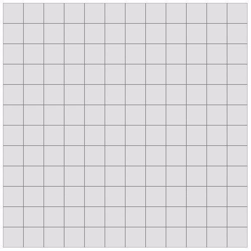
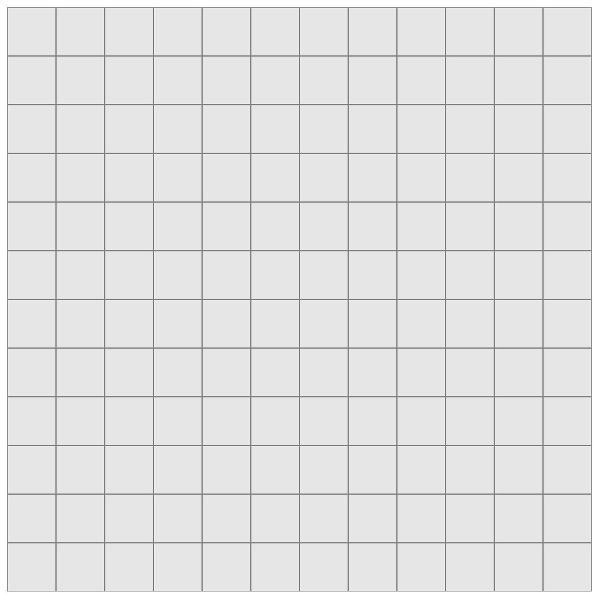
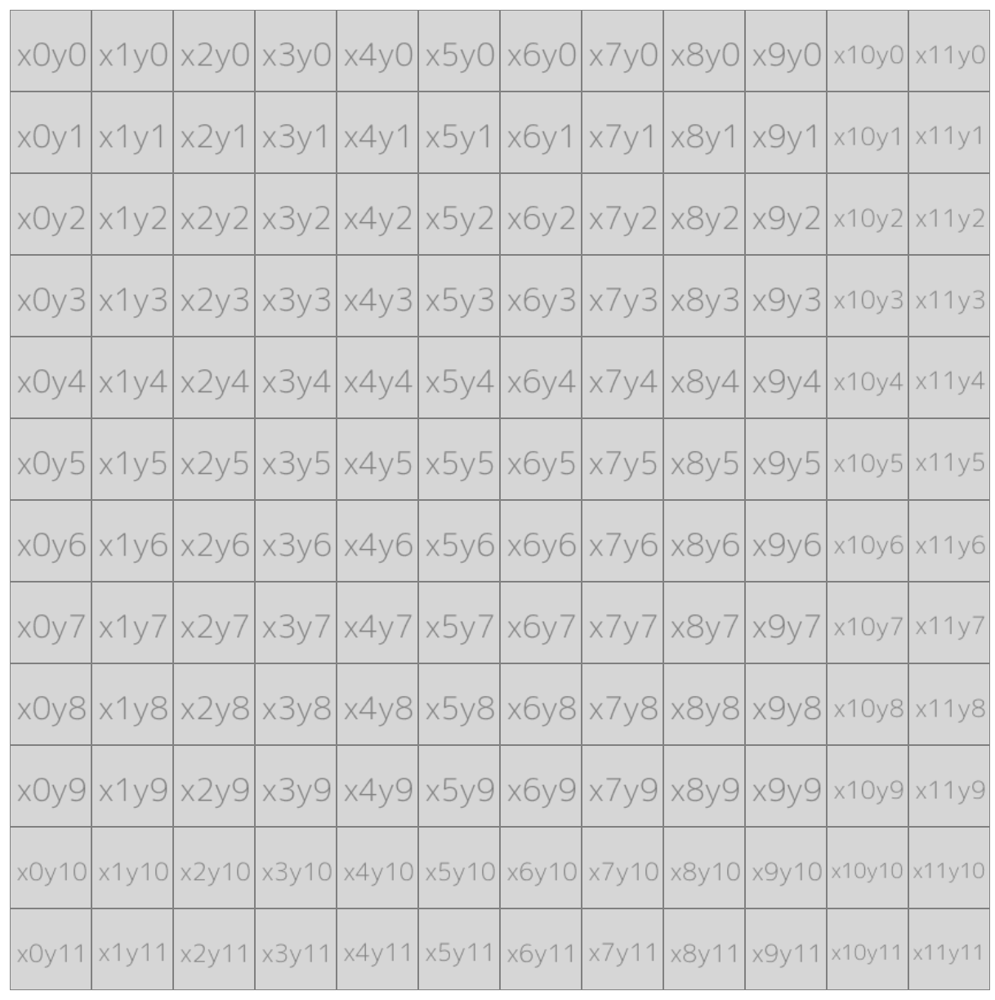
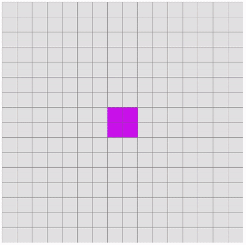
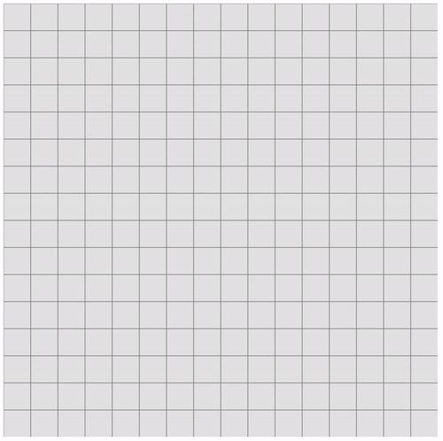
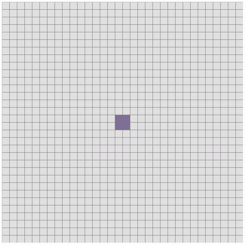

Isn't that a fancy name? It is but I couldn't find a simpler one. Its just what it is. An algorithm that draws cells starting from the center of a rectangular canvas, going outward, spirally. And, Rumil is my younger cat's name. Here's a [picture](https://twitter.com/eswordert/status/1398564524228292608?s=20) of him. There's no really any connection between my cat and this piece of program, just wanted to name it after him.

Probably there are algorithms implemented that does this or something similar to it. When I was working on my small side project [Spoticulum](https://github.com/ahmetomerv/spoticulum), I needed to find a way to map a bunch of images on a canvas, but starting from the center, and going outward. So I spent a good amount of time tinkering with loops but to only end in failure. I looked for something that does this but for some reason I couldn't find one, and believe me, my googling skills aren't even bad. So I went ahead and implemented my own version.

TLDR; Here's the [code](https://codepen.io/ahmetomer/pen/ExWObNa).

Demo of ROSA (short for Rumil's Outward Spiral Algorithm. Neat, isn't it?):



This is a `600x600` canvas with `50x50` cells. Each row going outward is colored differently with a delayed loop for demonstration.

### Creating a ROSA

First of all, we should make a few *helper* functions to *help* us create the canvas itself. To start out, I've used two functions to create a JavaScript canvas element that's rendered out without ratio and blur issues.

```javascript
const createHiDPICanvas = (width, height, ratio) => {
  width = width || window.innerWidth;
  height = height || window.innerHeight;
  const canvasElement = document.createElement('canvas');

  if (!ratio) {
    ratio = getPixelRatio();
  }

  canvasElement.width = width * ratio;
  canvasElement.height = height * ratio;
  canvasElement.style.width = width + 'px';
  canvasElement.style.height = height + 'px';
  canvasElement.style.background = '#e6e6e6';
  canvasElement.getContext('2d').setTransform(ratio, 0, 0, ratio, 0, 0);

  return canvasElement;
}
```

This `createHiDPICanvas` function takes three parameters, the first two of which will be supplied when we create the canvas. The third one, `ratio`, if not given, will be assigned from `getPixelRatio` which will generate a ratio value depending on the ratio of the client.

```javascript
const getPixelRatio = () => {
  const
    context = document.createElement('canvas').getContext('2d'),
    dpr = window.devicePixelRatio || 1,
    bsr = context.webkitBackingStorePixelRatio ||
    context.mozBackingStorePixelRatio ||
    context.msBackingStorePixelRatio ||
    context.oBackingStorePixelRatio ||
    context.backingStorePixelRatio || 1;

  return dpr / bsr;
};
```

This will give us the correct ratio for our canvas.

Next, we define the necessary constants for how we want our canvas to be like. This will be a big function so I'm going through it step by step.

```javascript
const createRosa = () => {
  const width = 600;
  const height = 600;
  const cellWidth = 50;
  const cellHeight = 50;
}
```

This will define the size of the canvas and each of the cells. My implementation is focused on a rectangular version, so we keep the numbers such that all sides are equal, a perfect square.

```javascript
  const cellSize = (cellWidth + cellHeight) / 2;
  const totalCells = (width / cellSize) * (height / cellSize);
  const rowsCount = (width / cellSize) / 2;
```

We get the size of a cell by adding the width and height, then divide by two. This might feel redundant, but I like to keep this one wide open in front of me. `totalCells` is important for calculating how many rows we should iterate over in the canvas, which is a grid of cells. We get that by dividing both the `width` and `height` of the canvas by `cellSize`, then multiply them together.

The `rowsCount` constant is an important one here. It decides how many rows a rectangular canvas can have based on the width and cell size. We'll use this for the main loop to iterate through the rows.

The `totalCells`, as it suggests, hold the number of the cells of our canvas. We'll use this to check whether we've finished iterating through all the cells.

```javascript
  const canvas = createHiDPICanvas(width, height);
  let context = canvas.getContext('2d');
  const p = context.lineWidth / 3;
  let canvasTarget = document.getElementById('canvas') || document.body;
```

Here we create the actual canvas using our previously defined `createHiDPICanvas` function, passing it `width` and `height`, then we create a canvas context from it. `p` is the padding value to amount for the width of the grid lines, which I'll come to soon. At this point, we should be having a `div` element by the id `canvas`.

Now that's the canvas is ready, we can start picking up a brush and draw some stuff on it. Firstly, we should (or can) draw a simple grid.

```javascript
  canvasTarget.appendChild(canvas);
  context.strokeStyle = 'grey';
  context.lineWidth = 1;

  for (let i = 0; i <= (width / 10) * 4; i++) {
    const x = i * cellHeight;
    context.moveTo(x, 0);
    context.lineTo(x, canvas.height);
    context.stroke();

    const y = i * cellWidth;
    context.moveTo(0, y);
    context.lineTo(canvas.width, y);
    context.stroke();
  }
```

This will produce the following result:



Now, this is where the actual algorithm comes to play. First, we need to define the starting point of which we start our "going outward" from. I'm assuming that the width and cell size of my canvas are even numbers. I haven't made it to work with odd numbers. Well, because, I'm lazy.

```javascript
  let startingXCell =  (width / cellSize) / 2 - 1;
  let startingYCell =  (width / cellSize) / 2 - 1;
```

We need a starting point for `x` and `y` axis, since we're working on a 2d canvas, obviously. So, for example, a `600x600` canvas's `x` and `y` axis' starting point will be `x5`, `y5`. Because `600` (`width`) / `50` (`cellSize`) equals `12`, and divide that by `2` to get the middle point, we get `6`. I'm doing a `-1` to start the loop from the left side and to continue clockwise.

Next, the backbone of the algorithm:

```javascript
  let stepsToTakeRight = 1;
  let stepsToTakeBottom = 1;
  let stepsToTakeLeft = 1;
  let stepsToTakeTop = 1;
  let stepsBaseCount = 1;

  let rightStepLastCell = { x: 0, y: 0 };
  let bottomStepLastCell = { x: 0, y: 0 };
  let leftStepLastCell = { x: 0, y: 0 };
  let topStopLastCell = { x: 0, y: 0 };

  let stepCounter = 0;
  let cellIndexCounter = 0;
  let stepsToTake = stepsToTakeRight + stepsToTakeBottom + stepsToTakeLeft + stepsToTakeTop;
```

This block basically handles how many steps to take for each row iteration and tracks the cells by the end of each iteration, which will be needed to know where to start the next row outward from.

Before getting to the loops where the whole thing works, we need a function that draws cells (e.g filling in a color or drawing an image) on specific coordinates with specific sizes.

```javascript
const drawCell = (xCell, yCell, color = 'ff3', context, p, cellSize = 50) => {
  const x = xCell * cellSize;
  const y = yCell * cellSize;

  context.fillStyle = '#' + color;
  context.fillRect(x + p, y + p, cellSize - p * 2, cellSize - p * 2);
}
```

The `xCell` and `yCell` parameters will be passed when going through the cells, they indicate the coordinates of the current cell. For example, the picture below shows each cell and their location based on the x and y axis:



By having the coordinates of a cell, we can know exactly where to draw something to. Since we defined our canvas in this case to be `600x600`, and each cell size to be `50`, a cell's x (or y) coordinate will be between `0` and `11`. Because `600 / 50` is `12`. Therefore, to draw a perfect squared cell based on the given coordinates, we multiply them by the original cell size we defined earlier, which was `50`. So a cell with `x5` and `y3`, the exact coordinates needed to draw on the canvas will be `x250` and `y150`.

In the `drawCell` function, I'm using [Canvas 2D](https://developer.mozilla.org/en-US/docs/Web/API/CanvasRenderingContext2D/fillRect) API's `fillRect` method. This takes in the `x` and `y` coordinates, and width and height of what we're drawing. Notice when we're calculating the coordinates and size, we also amount for the grid lines as a padding. `p` can be omitted if no grid lines are drawn.

At last, combining all of what we've defined earlier, we can now draw a grid of cells, in an "spirally outward" fashion.

```javascript
(function myLoop(z) {
  setTimeout(function() {
    let bgColor = getRandomHexCode();
    for (let i = 0; i < stepsToTake; i++) {
      if (stepsToTakeRight !== 0) {
        drawCell(startingXCell + i, startingYCell, bgColor, context, p, cellSize);
        cellIndexCounter++;
        stepsToTakeRight--;

        if (stepsToTakeRight === 0) {
          rightStepLastCell.x = startingXCell + i + 1;
          rightStepLastCell.y = startingYCell;
        }
      }

      if (stepsToTakeBottom !== 0 && stepsToTakeRight === 0) {
        drawCell(rightStepLastCell.x, startingYCell + stepCounter, bgColor, context, p, cellSize);
        cellIndexCounter++;
        stepCounter++;
        stepsToTakeBottom--;

        if (stepsToTakeBottom === 0) {
          bottomStepLastCell.x = rightStepLastCell.x;
          bottomStepLastCell.y = startingYCell + stepCounter;
          stepCounter = 0;
        }
      }

      if (stepsToTakeLeft !== 0 && stepsToTakeBottom === 0) {
        drawCell(bottomStepLastCell.x + stepCounter, bottomStepLastCell.y, bgColor, context, p, cellSize);
        cellIndexCounter++;
        stepCounter--;
        stepsToTakeLeft--;

        if (stepsToTakeLeft === 0) {
          leftStepLastCell.x = bottomStepLastCell.x + stepCounter;
          leftStepLastCell.y = bottomStepLastCell.y;
          stepCounter = 0;
        }
      }

      if (stepsToTakeTop !== 0 && stepsToTakeLeft === 0) {
        drawCell(leftStepLastCell.x, leftStepLastCell.y - stepCounter, bgColor, context, p, cellSize);
        cellIndexCounter++;
        stepCounter++;
        stepsToTakeTop--;

        if (stepsToTakeTop === 0) {
          topStepLastCell.x = leftStepLastCell.x;
          topStepLastCell.y = leftStepLastCell.y - stepCounter;
          stepCounter = 0;
        }
      }
    }

    if (cellIndexCounter < totalCells) {
      if (stepsToTakeTop === 0 && stepsToTakeLeft === 0 && stepsToTakeBottom === 0 && stepsToTakeRight === 0) {
        stepsBaseCount = stepsBaseCount + 2;
        startingXCell--;
        startingYCell--;
        stepsToTakeRight = stepsBaseCount;
        stepsToTakeBottom = stepsBaseCount;
        stepsToTakeLeft = stepsBaseCount;
        stepsToTakeTop = stepsBaseCount;
        stepsToTake = stepsToTakeRight + stepsToTakeBottom + stepsToTakeLeft + stepsToTakeTop;
      }
    }

    if (--z) myLoop(z);
  }, 700);
})(rowsCount);
```

The outer function is calling itself recursively. It basically acts as a loop but with a delay. A classic for loop can be used instead just fine if no delay is desired.

In the first iteration of the outer loop, it means we're going to draw cells for our first "row" from the center of the canvas. In that, we have a second loop, which will draw the cells of the currently iterated row. We've got four if clauses, each one for a side: right, bottom, left, top. As I mentioned before, it goes clockwise.

The logic for drawing a complete row is simpler than it seems: we start off by checking how many steps we can take, which is initially set to `4`, because for completing a whole row from the center of a square, we need four steps, one for each of the four sides. We go one step to the right side, set it's variable to `0`, track the last drawn cell, move on to the next cell with a new side to go for. And repeat.

At the end of the outer loop, we have another if clause. We first check if we've finished going over every cell. If we're not there yet, we check for another condition. If we've finished going over a whole row with all of it's cells, it means we no longer can take another step in that row, therefore we reset our step and cell trackers, so that in the next iteration, we can start drawing the next row. And the whole process repeats until its finished going over every cell.

The `getRandomHexCode` function, as it's name speaks for itself, generates a random hex code to color each row in the canvas.

```javascript
const getRandomHexCode = () => {
  return ''+(Math.random() * 0xFFFFFF << 0).toString(16).padStart(6, '0');
}
```

#### Examples and variations

Here's a `800x800` canvas example, only by changing the `width` and `height` constants. The `x` and `y` coordinates are drawn onto a custom image API, so each one is basically making a request to load the result, hence the delay.



This example, by using `cellIndexCounter`, renders each cell's index with the order it was drawn. Apparently there's a bug with the first index, I'll look into it I guess..



Lastly, this is a `800x800` canvas but with `25x25` cell size.



### Conclusion

Life's short, why do we spend so much time trying to make little stuff on computers behave the way we want? Like, don't have we better things to do? Maybe because it takes our minds off the painful harsh boredom of reality. I don't know. But, this was fun. I think my code shows a lot of promise for being refactored, to be more simple, smarter. I'm open to new ways of doing things. 