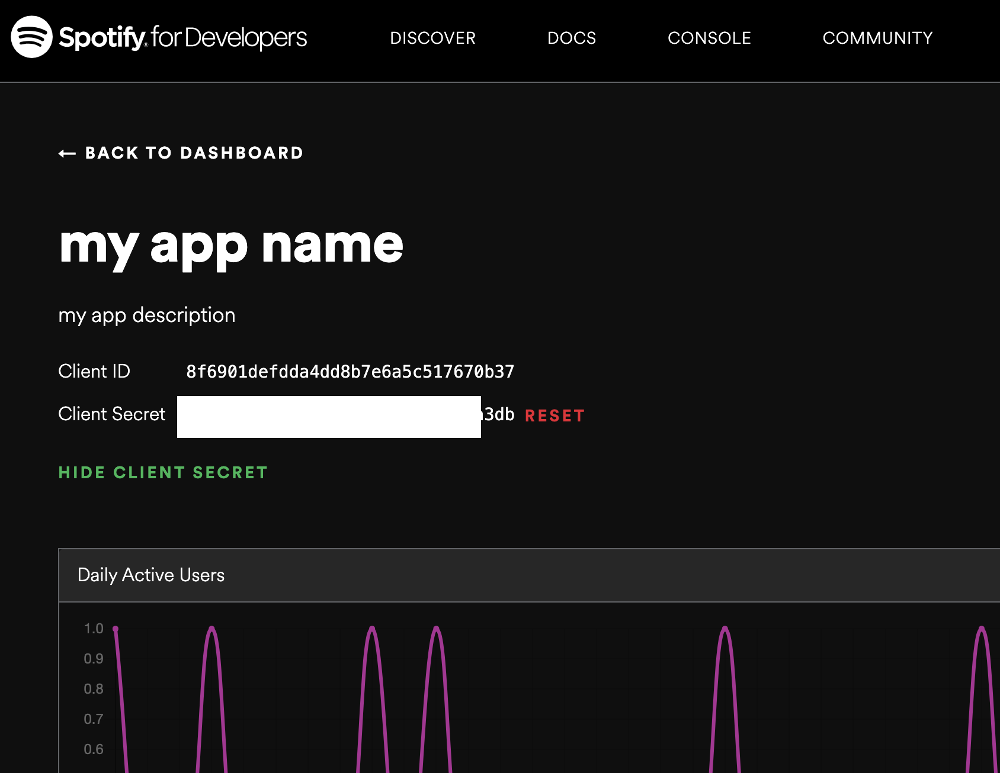
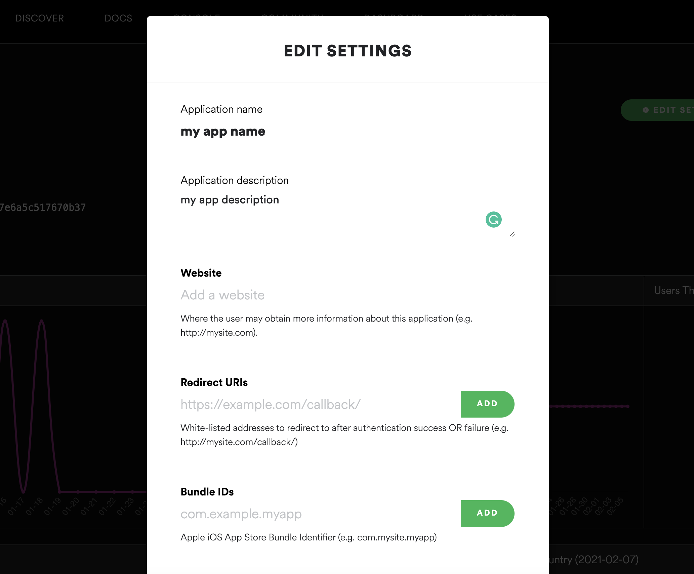
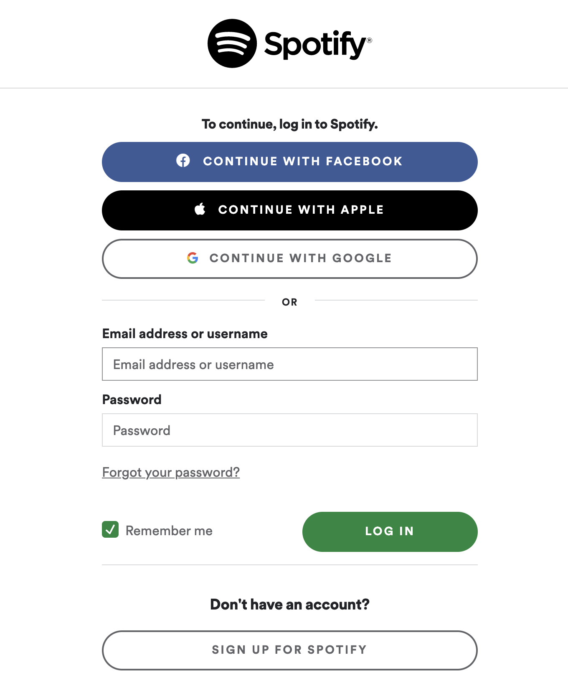
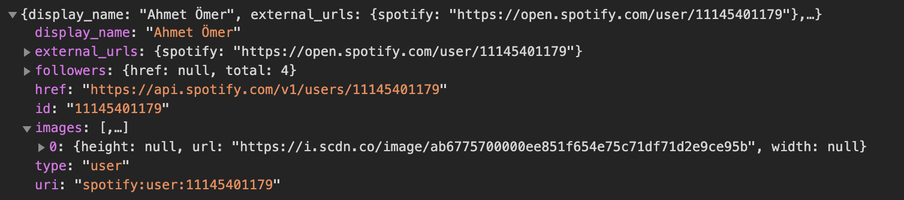
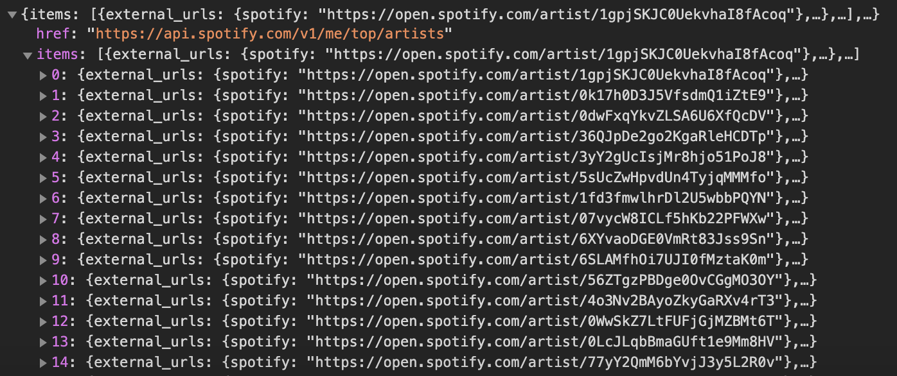

Spotify has many options that allow applications on most platforms to interact with their services. It has SDKs for iOS and Android. For the web, there are unofficial libraries that are developed by the community. You can see the full list [here](https://developer.spotify.com/documentation/web-api/libraries/).


The [Spotify Node API Wrapper](https://github.com/thelinmichael/spotify-web-api-node) by [Michael Thelin](https://github.com/thelinmichael) (Michael seems to be working at Spotify, but the library is not owned by the company) is a good library to choose. But it is not necessary or required to use an external library. You may as well interact with their services directly.

This article will go over on how to authorize Spotify users and a few examples on retrieving user data. In addition to Node, [Express](https://expressjs.com) will be used for routing and [dotenv](https://github.com/motdotla/dotenv) for environment variable management.

---

### Register an app and get a token

First of all, we need to create an app on Spotify Developer Dashboard which will give us a token that we can use in our Node app.

Go to [Spotify Dashboard](https://developer.spotify.com/dashboard/applications), login with your account, and click Create An App. Fill out the fields. You can change the name and description info later too.



Once it's created, click Show Client Secret and copy the token. This piece of string should be kept secret, hence the name, and never be published to a source control. There are crawlers on the internet searching for such tokens. Be cautious.

### Create a Node app

Next, we create a Node app. You can run `npm init` to start a new project then run the following command to install the necessary dependencies:

```ssh
$ npm install express dotenv cors node-fetch querystring
```

`node-fetch` is the equivalent of `fetch` on native browsers, but for Node. `querystring` is a module for parsing and formatting URLs. We'll use this to stringify objects when making HTTP calls to Spotify services.

In the `index.js` file (or whatever you named for your main entry), use the following code:

```javascript
const express = require('express');
const cors = require('cors');
require('dotenv').config();
const PORT = process.env.PORT || 8888;
const application = express();

application.use(express.json());
application.use(express.urlencoded({ extended: true}));
application.use(cors());

const AuthRoutes = require('./routes/authRoutes.js');
application.use('/api', cors(), AuthRoutes);

application.listen(PORT, () => {
  console.log(`Server started on port ${PORT}`);
});
```

This basically bootstraps a Node app with Express, cors and dotenv, and defines a route module, which we'll use to interact with Spotify. You can prefix the route however you like.

### Set up Environment Variables

Using `dotenv` we can seperate and load our environment-specific configuration variables into `process.env`, which will be available throughout the application, without having to expose or hardcode them.

Create a file named `.env` in the root of your project and add the following variables replacing `CLIENT_ID` and `CLIENT_SECRET` values with your tokens: (variable naming should be in the form `NAME=VALUE`)

```js
PORT=8888
CLIENT_ID="xxxxxxxxxxxxxxxxxxxxxxxxxxx"
CLIENT_SECRET="xxxxxxxxxxxxxxxxxxxxxxxxxxx"
REDIRECTURI="http://localhost:8888/api/logged"
CLIENT_REDIRECTURI="http://localhost:3000/"
```

`PORT` is where we'll be serving our Node app locally. `REDIRECTURI` is our app's endpoint where Spotify will redirect to after authorizing a user. And `CLIENT_REDIRECTURI` is where we'll redirect to for the frontend of our app.

For Spotify to trust your endpoint, you need to add it to your app's settings. Go to your app on [Spotify Dashboard](https://developer.spotify.com/dashboard/applications) and click Edit Settings.



In the Redirect URIs field, add `http://localhost:8888/api/logged`. Scroll down and click Save.

### Spotify Authorization

Next, we'll create and export the `AuthRoutes` module we defined in `index.js`. Create a file named `authRoutes.js` inside the `routes` folder. Then import the necessary dependencies:
```javascript
const express = require('express');
const router = express.Router();
const fetch = require('node-fetch');
const encodeFormData = require('../helperFunctions/encodeFormData.js');
const querystring = require('querystring');

module.exports = router;
```

Then, add the `/login` route:

```javascript
router.get('/login', async (req, res) => {
  const scope =
    `user-modify-playback-state
    user-read-playback-state
    user-read-currently-playing
    user-library-modify
    user-library-read
    user-top-read
    playlist-read-private
    playlist-modify-public`;

  res.redirect('https://accounts.spotify.com/authorize?' +
    querystring.stringify({
      response_type: 'code',
      client_id: process.env.CLIENT_ID,
      scope: scope,
      redirect_uri: process.env.REDIRECTURI
    })
  );
});
```

This route will accept get requests, authorize a user and redirect to our endpoint defined in `REDIRECTURI`, which is `/api/logged`.

The `scope` variable holds the permissions we need for our app. This also allows the users to know which data they'd be sharing with your app. You can see the full list [here](https://developer.spotify.com/documentation/general/guides/scopes).

Next, we create the `/logged` route:

```javascript
router.get('/logged', async (req, res) => {
  const body = {
    grant_type: 'authorization_code',
    code: req.query.code,
    redirect_uri: process.env.REDIRECTURI,
    client_id: process.env.CLIENT_ID,
    client_secret: process.env.CLIENT_SECRET,
  }

  await fetch('https://accounts.spotify.com/api/token', {
    method: 'POST',
    headers: {
      "Content-Type": "application/x-www-form-urlencoded",
      "Accept": "application/json"
    },
    body: encodeFormData(body)
  })
  .then(response => response.json())
  .then(data => {
    const query = querystring.stringify(data);
    res.redirect(`${process.env.CLIENT_REDIRECTURI}?${query}`);
  });
});
```

When a user is authorized, Spotify will redirect to this route with a code that we'll use to get access and refresh tokens (along with expiration date and scopes), then we redirect to our client with the same tokens which we'll use to get user data. This may be confusing, but will make sense later.

### The Frontend

Now, to test what we have, we need to run a client at port `3000`. I'm going with a React app seperately from our Node server, but it doesn't matter how you go on about your client as long as your `api/logged` route redirects to where your app runs.

_Note:_ Whether you run the client app seperately, or choose to serve from the same Node app, make sure to change the `REDIRECTURI` variable accordingly.

#### Login
In your client, simply make a GET call to `http://localhost:8888/api/login` either with a link, or a button. You'll be redirected to Spotify login screen:



When you login with your account, you'll be redirected to the endpoint defined in `REDIRECTURI`.

#### Getting the parameters from the URL
Once it's redirected, the URL should look like this:
```
http://localhost:3000/?access_token=xxxxxxxxxx&token_type=Bearer&expires_in=3600&refresh_token=xxxxxxxxxx&scope=xxxxxxxxxx-xxxxxxxxxx
```

To get the parameters, we can use the following method, which will return them as an object:

```javascript
const getHashParams = () => {
  const hashParams = {};
  let e,
    r = /([^&;=]+)=?([^&;]*)/g,
    q = window.location.search.substring(1);

  while (e = r.exec(q)) {
    hashParams[e[1]] = decodeURIComponent(e[2]);
  }

  return hashParams;
}
```

### Get Authenticated User Data

Using the tokens we received, we can make calls to Spotify services to get user data. For example, to get the current authenticated user, we can do so like the following:

```javascript
const url = 'https://api.spotify.com/v1/me';
const headers = {
  Authorization: 'Bearer ' + accessToken
}

fetch(url, { headers })
  .then(response => response.json())
  .then(data => {
    // use data
  })
  .catch(error => {
    // handle error
  });
```

The response should look something like this:



### Get User's Top Played Artists

As for another example, you can get a user's top played artists like the following:

```javascript
const url = 'https://api.spotify.com/v1/me/top/artists';
const headers = {
  Authorization: 'Bearer ' + accessToken
};

fetch(url , { headers })
  .then(response => response.json())
  .then(res => {
    // use data
  })
  .catch(error => {
    // handle error
  });
```

The response should look something like this:



---

Spotify has a rich API with many features. You can see all the services [here on official documentation](https://developer.spotify.com/documentation/web-api/reference). Using what we've created so far, we can interact with all of the services by providing the access tokens and required parameters.

There's currently no API rate limit, but it's best to retrieve multiple data entities at once to avoid hitting the limit. If you get the `status code 429`, it means your app has reached the limit. Check the `Retry-After` header to see how long you should wait before making another call.

### Deployment

When you deploy your apps, all you have to do is to update the environment variables. Update the `localhost` values to whatever your domain is. And make sure to update the values on your app settings on [Spotify Dashboard](https://developer.spotify.com/dashboard/applications).