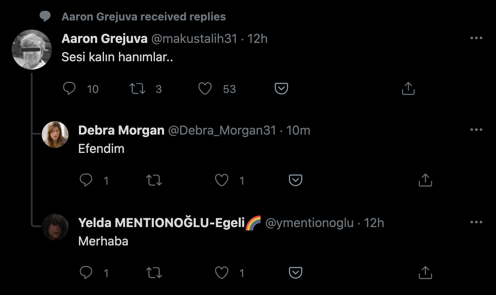
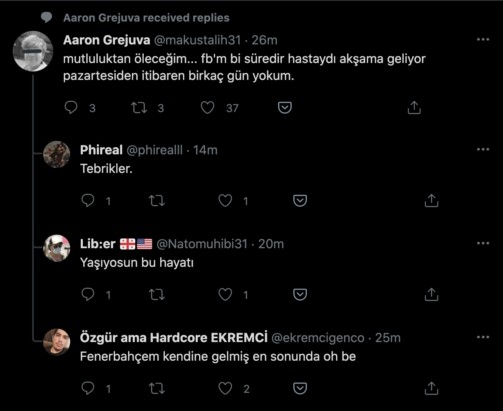
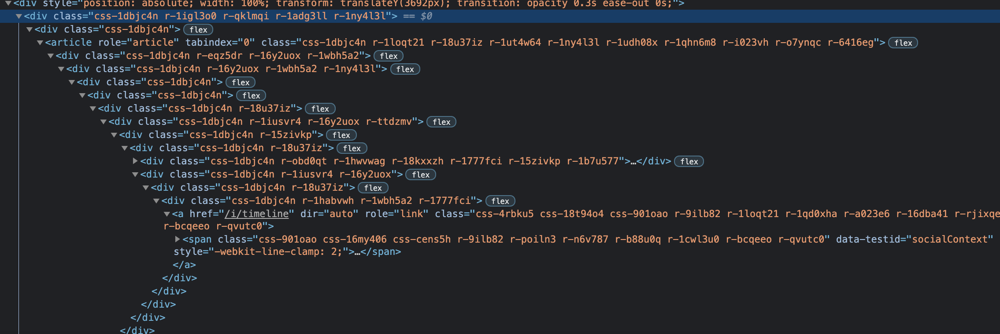

Twitter is a social networking service where you can follow people, see their Tweets and interact with them. It was so until Twitter decided it was totally fine to shove random Tweets down our throats with a big ugly shovel called "x received a reply" feature. I can't decide between evil or plain stupid to describe this feature. Hell it's a disgrace to even call it a "feature", because, it is not. The whole purpose of this to me it seems that Twitter so badly wants to grow their user base, increase the time a user spends on the site by being busy with random garbage and engage in more activities. At what cost? Well, for starters, you get a bunch of users swearing "why the hell do I have to see random Tweets on my timeline from people I don't follow?". Let alone the negative impact it has on having meaningful interaction and conversations among people with similar interest, to say the least. Because, the content you see is completely irrelevant to you.

This is not a problem of "if we tweak the algorithm enough it will be okay". No. It is fundamentally wrong. No one wants to scroll down their timeline and see a bunch of random Tweets from people they don't follow. That's what the Follow button is for. That's what the Like and Retweet buttons do. Those things ensure you get to explore people of the same (or even remotely) interest. This useless feature should either be optional, or completely flushed down the toilet. Can't put it any nicer than that.

All this might come off as an exaggerated and overreacted spout. I'm totally okay with that. But that doesn't mean I will refrain from giving some sweet criticism. I spend a good amount of time on Twitter, following local and global news, people I like and cat videos and stupid memes. So its important for me to see things I'm interested and have CHOSEN to see. Someone I follow liked a Tweet and it shows up on my timeline? That's the basics of Twitter. Don't love it, don't hate it. But that's where it should stop.

#### Few examples
It just took me a couple scrolls to see these reply Tweets. They're just mildly irrelevant...

At first it would show only one reply Tweet. But then Twitter goes "I can do better than that!" and now it shows two, sometimes the courage to even three irrelevant random Tweets on my timeline.

#### Solution
There's none.

Someone on this [Reddit post](https://www.reddit.com/r/Twitter/comments/eu8anj/how_to_remove_x_received_a_reply_on_feed) suggests to just flag those reply Tweets as "not interested in" and hope that it will go away. Let's be honest, that's just naive. So yes, there's none.
#### Alternative Solution
There's probably no alternative solution for native Twitter apps so I went on making a [browser extension](https://github.com/ahmetomerv/clean-twitter) for the web to filter out these Tweets. What this extension simply does is initialize a MutationObserver instance, check the loaded DOM elements if they contain a particular keyword (such as "received a reply" in this case) and remove it from the DOM.

This seems quite simple to do, as I thought in the beginning. But two problems arise:

- DOM elements have uglified class names, thus can't select Tweets properly
- Twitter changes the DOM frequently (my guess is that it does) so my trivial algorithm to detect and delete Tweet nodes needs to be tweaked ever time a change happens

This is what a Tweet looks like in the DOM: (Beautiful, isn't it? It reminds me of [Botticelli's Map of Hell](https://upload.wikimedia.org/wikipedia/commons/thumb/3/3e/Sandro_Botticelli_-_La_Carte_de_l%27Enfer.jpg/600px-Sandro_Botticelli_-_La_Carte_de_l%27Enfer.jpg): 13 Levels of DOM Hell!)

Luckily, every Liked, Retweeted and Reply Tweet has an attribute called `data-testid` with the value `socialContext`. So that's a good starting point. From there we can check the `innerText` and determine its Tweet type.

So, to summarize the whole process:

- Run a function every time a change happens in the DOM.
- This function selects all the Tweets and assigns a custom data attribute based on their type (e.g. `data-tweetid="retweeted"`).
- Send each Tweet node to a recursive function to find the 'uppermost' Tweet element.
- The 'uppermost' Tweet element is an article with the `role="article"` attribute, find that and delete it.

At the moment this extension needs some maintenance, if you check the code you can see it stinks a bit. I'm feeling lazy to work on this, but thanks to Twitter, every day I'm tempted (forced!!) to come back and fix the extension to make it work properly.
